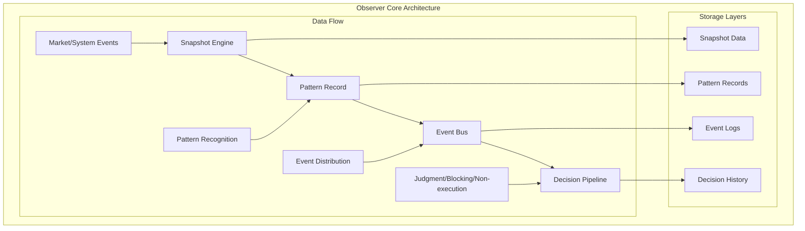
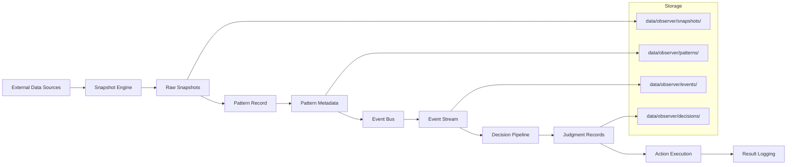
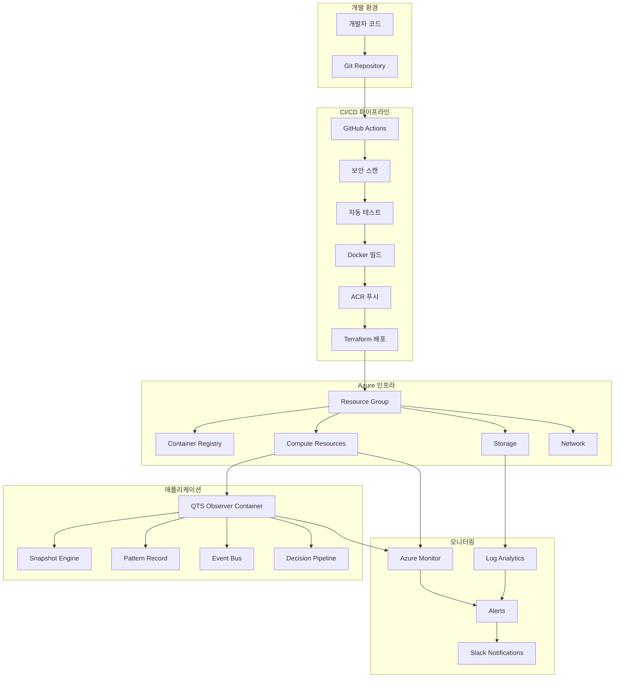
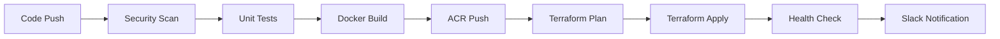
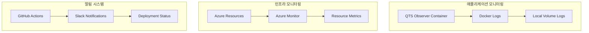
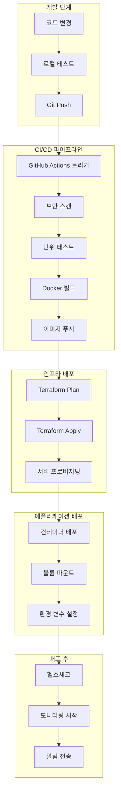

# QTS Observer 아키텍처 문서 (초안)

**버전:** v2.0.0  
**작성일:** 2026-01-11  
**상태:** 현재 구축 상태 기반 초안  
**범위:** Docker 패키징부터 Terraform 인프라, GitHub Actions CI/CD 자동화까지 전체 배포 종료시점 기준

---

## 1. 아키텍처 개요

### 1.1 시스템 철학

QTS Observer 시스템은 **"Package → Deploy → Automate → Monitor"** 4단계 철학을 따릅니다:

1. **Package**: Docker 컨테이너화로 애플리케이션 패키징
2. **Deploy**: Terraform으로 Azure 인프라 프로비저닝
3. **Automate**: GitHub Actions로 CI/CD 파이프라인 자동화
4. **Monitor**: 배포 후 지속적인 모니터링 및 운영

### 1.2 현재 구축 상태

#### ✅ 완료된 구성요소
- **Docker 패키징**: Dockerfile, docker-compose.yml, standalone 모드
- **Terraform 인프라**: Azure Resource Group, 원격 상태 관리
- **GitHub Actions**: 기본 CI/CD 파이프라인 (terraform.yml, deploy.yml)
- **보안 스캔**: Trivy 취약점 스캔 통합
- **알림 시스템**: Slack 알림 연동

#### 🔄 진행 중인 구성요소
- **고급 CI/CD**: 다중 환경 (dev/staging/prod)
- **모니터링**: Azure Monitor, Application Insights
- **보안 강화**: 네트워크 격리, Key Vault

### 1.3 아키텍처 목표

- **재현성**: 동일한 환경에서 언제나 동일한 배포 결과
- **자동화**: 수작업 최소화, 일관된 배포 프로세스
- **확장성**: 수평/수직 확장 및 추가 모듈 추가 용이
- **관찰성**: 포괄적인 모니터링 및 로깅

---

## 2. QTS Observer 프로그램 아키텍처

### 2.1 Observer 코어 아키텍처

#### 핵심 컴포넌트 구조


#### Observer 컴포넌트 상세

##### **Snapshot Engine**
- **역할**: 시장/시스템 상태의 특정 시점 관찰 데이터 수집
- **주요 기능**:
  - 실시간 데이터 스냅샷 생성
  - 다양한 소스(시장, 시스템, 외부 API) 데이터 통합
  - 데이터 정규화 및 포맷 통일
- **출력**: 구조화된 스냅샷 데이터 (JSON/파켓 형식)

##### **Pattern Record**
- **역할**: 스냅샷 데이터를 분석하여 의미 있는 패턴 추출
- **주요 기능**:
  - 시계열 패턴 인식
  - 이상 감지 및 변화점 식별
  - 패턴 분류 및 태깅
- **출력**: 패턴 메타데이터 및 분석 결과

##### **Event Bus**
- **역할**: 패턴을 이벤트로 변환하여 구독자에게 배포
- **주요 기능**:
  - 이벤트 라우팅 및 필터링
  - 비동기 메시지 처리
  - 이벤트 지속성 및 재생
- **출력**: 구독자별 맞춤형 이벤트 스트림

##### **Decision Pipeline**
- **역할**: 패턴/이벤트 기반 의사결정 및 실행 기록
- **주요 기능**:
  - 판단(Judgment): 상태 분석 및 평가
  - 차단(Blocking): 위험 요소 차단 결정
  - 비실행(Non-execution): 실행 보류 기록
- **출력**: 의사결정 로그 및 실행 결과

### 2.2 Observer 런타임 아키텍처

#### Standalone 모드 구조
```
QTS Observer Runtime
├── Core Engine
│   ├── observer.py              # 메인 실행 파일
│   ├── paths.py                 # 경로 해석 모듈
│   └── deployment_config.json  # 배포 설정
├── Source Modules
│   ├── src/observer/           # 핵심 Observer 모듈
│   ├── src/automation/        # 자동화 모듈
│   ├── src/backup/            # 백업 모듈
│   ├── src/decision_pipeline/ # 의사결정 파이프라인
│   ├── src/logs/              # 로깅 모듈
│   ├── src/maintenance/       # 유지보수 모듈
│   ├── src/retention/         # 보존 정책 모듈
│   ├── src/runtime/           # 런타임 모듈
│   ├── src/safety/            # 안전 모듈
│   └── src/shared/            # 공유 유틸리티
├── Data Storage
│   ├── data/observer/         # 스냅샷/패턴 데이터
│   ├── logs/                  # 애플리케이션 로그
│   └── config/                # 설정 파일
└── Runtime Configuration
    ├── Environment Variables  # 런타임 환경 설정
    └── Health Check          # 상태 모니터링
```

#### 데이터 흐름 아키텍처


### 2.3 Observer와 배포 아키텍처 연계

#### 레이어 통합 모델
```
Observer Application Layer
├── Snapshot Engine → Docker Volume Mount (/app/data/observer/snapshots)
├── Pattern Record → Docker Volume Mount (/app/data/observer/patterns)
├── Event Bus → Docker Volume Mount (/app/data/observer/events)
└── Decision Pipeline → Docker Volume Mount (/app/data/observer/decisions)
         ↓
Deployment Configuration Layer
├── Environment Variables (QTS_OBSERVER_STANDALONE=1)
├── Runtime Paths (PYTHONPATH, OBSERVER_DATA_DIR, OBSERVER_LOG_DIR)
├── Container Configuration (Dockerfile, docker-compose.yml)
└── Health Monitoring (Container Health Check)
         ↓
Infrastructure Management Layer
├── Azure Resource Group (리소스 관리)
├── Terraform IaC (인프라 코드화)
├── GitHub Actions (자동화 배포)
└── Azure Storage (백업 및 상태 저장)
```

#### 배포 시 Observer 고려사항
1. **데이터 지속성**: Docker 볼륨 마운트로 스냅샷/패턴 데이터 보존
2. **상태 일관성**: deployment_config.json과 실제 경로 일치
3. **런타임 안정성**: Standalone 모드 환경 변수 설정
4. **재현성**: 동일한 설정으로 동일한 Observer 상태 재현

---

## 3. 컴포넌트 아키텍처

### 3.1 전체 시스템 다이어그램



### 3.2 레이어별 아키텍처

#### 애플리케이션 레이어
```
QTS Observer Application
├── Core Observer Engine
│   ├── Snapshot: 시장/시스템 이벤트 관찰
│   ├── PatternRecord: 스냅샷을 패턴으로 변환
│   ├── EventBus: 패턴을 이벤트로 배포
│   └── Decision Pipeline: 판단/차단/비실행 기록
├── Runtime Configuration
│   ├── Environment Variables
│   ├── deployment_config.json
│   └── Volume Mounts
└── Health & Monitoring
    ├── Health Check Endpoint
    ├── Application Metrics
    └── Log Management
```

#### 배포 레이어
```
Deployment Layer
├── Docker Containerization
│   ├── Dockerfile (Python 3.11-slim)
│   ├── docker-compose.yml
│   └── Volume Management
├── Package Distribution
│   ├── qts_ops_deploy.tar.gz
│   ├── start_ops.sh
│   └── MANIFEST.txt
└── Runtime Environment
    ├── Standalone Mode
    ├── Data Persistence
    └── Log Persistence
```

#### 인프라 레이어
```
Infrastructure Layer
├── Azure Resources
│   ├── Resource Group
│   ├── Container Registry
│   ├── Compute (VM/Container Instances)
│   ├── Storage Account
│   └── Networking
├── Infrastructure as Code
│   ├── Terraform Configuration
│   ├── Remote State Management
│   └── Modular Design
└── Security & Compliance
    ├── Azure AD Integration
    ├── Network Security Groups
    └── Key Vault
```

---

## 3. Docker 패키징 아키텍처

### 3.1 컨테이너 설계

#### 현재 Dockerfile 구조
```dockerfile
FROM python:3.11-slim

WORKDIR /app

# 애플리케이션 복사
COPY observer.py /app/
COPY paths.py /app/
COPY src/ /app/src/

# 디렉토리 생성
RUN mkdir -p /app/data/observer \
    && mkdir -p /app/logs \
    && mkdir -p /app/config

# 환경 변수 설정
ENV QTS_OBSERVER_STANDALONE=1
ENV PYTHONPATH=/app/src:/app
ENV OBSERVER_DATA_DIR=/app/data/observer
ENV OBSERVER_LOG_DIR=/app/logs

# 보안 설정
RUN groupadd -r qts && useradd -r -g qts qts
RUN chown -R qts:qts /app
USER qts

# 헬스체크
HEALTHCHECK --interval=30s --timeout=10s --start-period=5s --retries=3 \
    CMD python -c "import sys; sys.exit(0)" || exit 1

EXPOSE 8000

CMD ["python", "observer.py"]
```

#### docker-compose.yml 구성
```yaml
version: '3.8'

services:
  qts-observer:
    build: .
    container_name: qts-observer
    restart: unless-stopped
    environment:
      - QTS_OBSERVER_STANDALONE=1
      - PYTHONPATH=/app/src:/app
      - OBSERVER_DATA_DIR=/app/data/observer
      - OBSERVER_LOG_DIR=/app/logs
    volumes:
      - ./data:/app/data/observer
      - ./logs:/app/logs
      - ./config:/app/config
    ports:
      - "8000:8000"
    networks:
      - qts-network

networks:
  qts-network:
    driver: bridge
```

### 3.2 패키지 배포 프로세스

#### 로컬 배포
```bash
# 1. 패키징
cd app
./deploy_ops.sh

# 2. Docker 실행
cd qts_ops_deploy
docker-compose up -d

# 3. 상태 확인
docker ps
docker logs qts-observer
```

#### 원격 배포
```bash
# 1. 패키지 전송
scp qts_ops_deploy.tar.gz user@host:/opt/

# 2. 원격 배포
ssh user@host "cd /opt && tar -xzf qts_ops_deploy.tar.gz && cd qts_ops_deploy && docker-compose up -d"
```

---

## 4. Terraform 인프라 아키텍처

### 4.1 현재 인프라 구조

#### 핵심 구성요소
```hcl
# provider.tf - Azure 프로바이더 설정
provider "azurerm" {
  features {}
  subscription_id = "632e6f30-269e-42d2-96a5-9c3618bd358e"
  tenant_id       = "cbd7850b-7a48-4769-80f5-3b08ab27243f"
}

# backend.tf - 원격 상태 관리
terraform {
  backend "azurerm" {
    resource_group_name  = "rg-observer-test"
    storage_account_name = "observerstorage"
    container_name       = "tfstate"
    key                  = "terraform.tfstate"
  }
}

# main.tf - 리소스 정의
module "resource_group" {
  source   = "./modules/resource_group"
  name     = var.resource_group_name
  location = var.location
}
```

#### 모듈 구조
```
infra/
├── main.tf                    # 메인 리소스 정의
├── variables.tf               # 변수 정의
├── outputs.tf                 # 출력값 정의
├── provider.tf                # Azure 프로바이더
├── backend.tf                 # 원격 상태 저장
├── terraform.tfvars           # 환경 변수
├── modules/
│   └── resource_group/        # 리소스 그룹 모듈
│       ├── main.tf
│       ├── variables.tf
│       └── outputs.tf
└── scripts/
    └── deploy_to_infrastructure.sh
```

### 4.2 배포 프로세스

#### 수동 배포
```bash
cd infra
terraform init
terraform plan -var-file="terraform.tfvars"
terraform apply -var-file="terraform.tfvars" -auto-approve
```

#### 자동화 배포 (GitHub Actions)
```yaml
# .github/workflows/terraform.yml
- name: Terraform Init
  run: terraform init
  
- name: Terraform Plan
  run: terraform plan -var-file="terraform.tfvars"
  
- name: Terraform Apply
  if: github.ref == 'refs/heads/main' && github.event_name == 'push'
  run: terraform apply -var-file="terraform.tfvars" -auto-approve
```

---

## 5. GitHub Actions CI/CD 아키텍처

### 5.1 파이프라인 설계

#### 현재 워크플로우 구조


### 5.2 주요 워크플로우

#### 기본 Terraform CI (terraform.yml)
```yaml
name: Terraform CI

on:
  push:
    branches: [main]
  pull_request:
    branches: [main]

jobs:
  terraform:
    runs-on: ubuntu-latest
    env:
      ARM_SUBSCRIPTION_ID: ${{ secrets.ARM_SUBSCRIPTION_ID }}
      ARM_TENANT_ID: ${{ secrets.ARM_TENANT_ID }}
      ARM_CLIENT_ID: ${{ secrets.ARM_CLIENT_ID }}
      ARM_CLIENT_SECRET: ${{ secrets.ARM_CLIENT_SECRET }}
    steps:
      - name: Checkout code
        uses: actions/checkout@v4
      - name: Set up Terraform
        uses: hashicorp/setup-terraform@v3
      - name: Terraform Init
        run: terraform init
      - name: Terraform Plan
        run: terraform plan -var-file="terraform.tfvars"
      - name: Terraform Apply
        if: github.ref == 'refs/heads/main' && github.event_name == 'push'
        run: terraform apply -var-file="terraform.tfvars" -auto-approve
```

#### 전체 CI/CD 파이프라인 (deploy.yml)
```yaml
name: QTS Observer CI/CD Pipeline

on:
  push:
    branches: [main, develop]
  pull_request:
    branches: [main, develop]

jobs:
  security-scan:
    # Trivy 취약점 스캔
  
  test:
    # 단위 테스트 실행
  
  build:
    # Docker 빌드 및 ACR 푸시
  
  terraform:
    # Terraform 인프라 배포
  
  health-check:
    # 배포 후 헬스체크
  
  notify:
    # Slack 알림 전송
```

### 5.3 필수 Secrets 설정

```bash
# Azure 인증 정보
ARM_SUBSCRIPTION_ID
ARM_TENANT_ID
ARM_CLIENT_ID
ARM_CLIENT_SECRET

# Container Registry
ACR_USERNAME
ACR_PASSWORD

# 알림
SLACK_WEBHOOK_URL
```

---

## 6. 모니터링 및 운영 아키텍처

### 6.1 모니터링 구성

#### 현재 모니터링 상태


### 6.2 로깅 전략

#### 컨테이너 로그 수집
```bash
# 실시간 로그 확인
docker logs -f qts-observer

# 로컬 볼륨 로그 확인
tail -f logs/observer.log

# 로그 파일 구조
logs/
├── observer.log          # 메인 애플리케이션 로그
├── snapshot.log          # 스냅샷 처리 로그
├── pattern.log           # 패턴 기록 로그
└── decision.log          # 의사결정 로그
```

#### 데이터 지속성
```bash
# 데이터 볼륨 구조
data/
└── observer/
    ├── snapshots/        # 스냅샷 데이터
    ├── patterns/         # 패턴 기록
    ├── events/           # 이벤트 버스 데이터
    └── decisions/        # 의사결정 기록
```

### 6.3 헬스체크 및 알림

#### 컨테이너 헬스체크
```dockerfile
HEALTHCHECK --interval=30s --timeout=10s --start-period=5s --retries=3 \
    CMD python -c "import sys; sys.exit(0)" || exit 1
```

#### 배포 상태 알림
```yaml
# Slack 알림 예시
- name: Send Slack notification on success
  if: success()
  uses: slackapi/slack-github-action@v1
  with:
    payload: |
      {
        "text": "✅ QTS Observer 배포 성공!",
        "blocks": [
          {
            "type": "section",
            "text": {
              "type": "mrkdwn",
              "text": "*QTS Observer 배포 성공*\n브랜치: ${{ github.ref }}\n커밋: ${{ github.sha }}\n작업자: ${{ github.actor }}"
            }
          }
        ]
      }
```

---

## 7. 보안 아키텍처

### 7.1 현재 보안 구현

#### 컨테이너 보안
- **비-root 사용자**: qts 사용자로 실행
- **최소 권한**: 필요한 권한만 부여
- **헬스체크**: 컨테이너 상태 모니터링

#### 인프라 보안
- **Azure AD 통합**: Service Principal 인증
- **원격 상태 관리**: Azure Storage에 암호화 저장
- **비밀 정보 관리**: GitHub Secrets 사용

#### 코드 보안
- **Trivy 스캔**: 취약점 자동 스캔
- **SARIF 결과**: GitHub Security 탭에 통합

### 7.2 보안 강화 계획

#### 네트워크 보안
```hcl
# 향후 추가 예정
resource "azurerm_network_security_group" "main" {
  name                = "nsg-observer"
  location            = azurerm_resource_group.main.location
  resource_group_name = azurerm_resource_group.main.name
  
  security_rule {
    name                       = "allow-http"
    priority                   = 100
    direction                  = "Inbound"
    access                     = "Allow"
    protocol                   = "Tcp"
    source_port_range          = "*"
    destination_port_range     = "8000"
    source_address_prefix      = "*"
    destination_address_prefix = "*"
  }
}
```

#### Key Vault 통합
```hcl
# 향후 추가 예정
resource "azurerm_key_vault" "main" {
  name                = "kv-observer"
  location            = azurerm_resource_group.main.location
  resource_group_name = azurerm_resource_group.main.name
  tenant_id           = data.azurerm_client_config.current.tenant_id
  
  sku_name = "standard"
}
```

---

## 8. 배포 프로세스

### 8.1 전체 배포 흐름



### 8.2 배포 체크리스트

#### 배포 전 확인사항
- [ ] 코드 품질 검증 통과
- [ ] 보안 스캔 결과 확인
- [ ] 단위 테스트 통과
- [ ] Docker 이미지 빌드 성공
- [ ] Terraform plan 검토

#### 배포 중 확인사항
- [ ] 인프라 리소스 생성 성공
- [ ] 컨테이너 배포 성공
- [ ] 볼륨 마운트 정상
- [ ] 환경 변수 설정 완료

#### 배포 후 확인사항
- [ ] 헬스체크 통과
- [ ] 애플리케이션 로그 정상
- [ ] 데이터 볼륨 접근 가능
- [ ] 모니터링 지표 수집
- [ ] 알림 시스템 동작

---

## 9. 향후 확장 계획

### 11.1 단기 확장 (1-3개월)

#### 모니터링 강화
- Azure Monitor 통합
- Application Insights 연동
- 커스텀 메트릭 대시보드
- 자동 알림 규칙 설정

#### CI/CD 고도화
- 다중 환경 지원 (dev/staging/prod)
- 블루-그린 배포 전략
- 롤백 자동화
- 배포 게이트 추가

### 11.2 중기 확장 (3-6개월)

#### 인프라 확장
- Virtual Network 구성
- Load Balancer 추가
- Auto Scaling 구현
- 고가용성 아키텍처

#### 보안 강화
- Network Security Group
- Azure Key Vault 통합
- 정기 취약점 스캔
- 컴플라이언스 모니터링

### 11.3 장기 확장 (6개월 이상)

#### 마이크로서비스 전환
- 서비스 분리 전략
- API Gateway 도입
- 서비스 메시 구현
- 분산 추적 시스템

#### 데이터 파이프라인
- 실시간 데이터 처리
- 데이터 레이크 구축
- 머신러닝 파이프라인
- 고급 분석 기능

---

## 10. 운영 가이드

### 10.1 일일 운영 절차

#### 모니터링 체크리스트
```bash
# 1. 컨테이너 상태 확인
docker ps | grep qts-observer

# 2. 리소스 사용량 확인
docker stats qts-observer --no-stream

# 3. 로그 에러 확인
docker logs qts-observer --since 24h | grep -i error

# 4. 디스크 사용량 확인
df -h /app/data/observer

# 5. 네트워크 연결 확인
curl -f http://localhost:8000/health || echo "Health check failed"
```

### 10.2 장애 대응 절차

#### 컨테이너 장애
```bash
# 1. 로그 확인
docker logs qts-observer --tail 100

# 2. 컨테이너 재시작
docker-compose restart qts-observer

# 3. 이미지 재빌드 (필요시)
docker-compose build --no-cache
docker-compose up -d
```

#### 인프라 장애
```bash
# 1. Terraform 상태 확인
terraform show

# 2. 리소스 상태 확인
terraform plan -var-file="terraform.tfvars"

# 3. 특정 리소스만 재배포
terraform apply -target=module.resource_group -auto-approve
```

### 10.3 성능 최적화

#### 컨테이너 최적화
```yaml
# docker-compose.yml 추가 설정
services:
  qts-observer:
    deploy:
      resources:
        limits:
          cpus: '1.0'
          memory: 512M
        reservations:
          cpus: '0.5'
          memory: 256M
    logging:
      driver: "json-file"
      options:
        max-size: "10m"
        max-file: "3"
```

#### 인프라 최적화
```hcl
# 리소스 태그 표준화
tags = {
  environment = "production"
  project     = "qts-observer"
  managed_by  = "terraform"
  cost_center = "engineering"
}
```

---

## 12. 참고 문서

### 12.1 기술 문서
- [Docker 공식 문서](https://docs.docker.com/)
- [Terraform Azure Provider](https://registry.terraform.io/providers/hashicorp/azurerm/latest/docs)
- [GitHub Actions 문서](https://docs.github.com/en/actions)
- [Azure Monitor 가이드](https://docs.microsoft.com/azure/azure-monitor/)

### 12.2 프로젝트 문서
- [docs/ops_Architecture.md](ops_Architecture.md) - Observer 코어 아키텍처
- [docs/CI_CD_OPTIMIZATION.md](CI_CD_OPTIMIZATION.md) - CI/CD 최적화 가이드
- [infra/README.md](../infra/README.md) - Terraform 상세 가이드
- [app/qts_ops_deploy/README.md](../app/qts_ops_deploy/README.md) - Docker 배포 가이드

### 12.3 운영 문서
- [docs/todo/todo.md](todo/todo.md) - 현재 진행 상황
- [docs/report/](report/) - 정기 보고서
- [.github/workflows/](../.github/workflows/) - CI/CD 워크플로우

---

## 13. 부록

### 13.1 용어 정의

| 용어 | 정의 |
|------|------|
| **Snapshot** | 시장/시스템 상태의 특정 시점 관찰 데이터 |
| **PatternRecord** | 스냅샷을 분석하여 추출된 패턴 정보 |
| **EventBus** | 패턴을 이벤트로 변환하여 배포하는 메시지 버스 |
| **Standalone Mode** | 독립적으로 실행되는 Observer 모드 |
| **IaC** | Infrastructure as Code, 코드로 관리하는 인프라 |
| **CI/CD** | Continuous Integration/Continuous Deployment |

### 13.2 환경 변수 참조

| 변수명 | 기본값 | 설명 |
|--------|--------|------|
| QTS_OBSERVER_STANDALONE | 1 | Standalone 모드 활성화 |
| PYTHONPATH | /app/src:/app | Python 모듈 경로 |
| OBSERVER_DATA_DIR | /app/data/observer | 데이터 저장 경로 |
| OBSERVER_LOG_DIR | /app/logs | 로그 저장 경로 |

### 13.3 포트 정보

| 포트 | 용도 | 설명 |
|------|------|------|
| 8000 | 애플리케이션 | 향후 웹 인터페이스용 (현재 미구현) |

---

**문서 버전:** v2.0.0  
**마지막 업데이트:** 2026-01-11  
**다음 리뷰 예정:** 2026-01-25  
**책임자:** QTS Observer 개발팀
