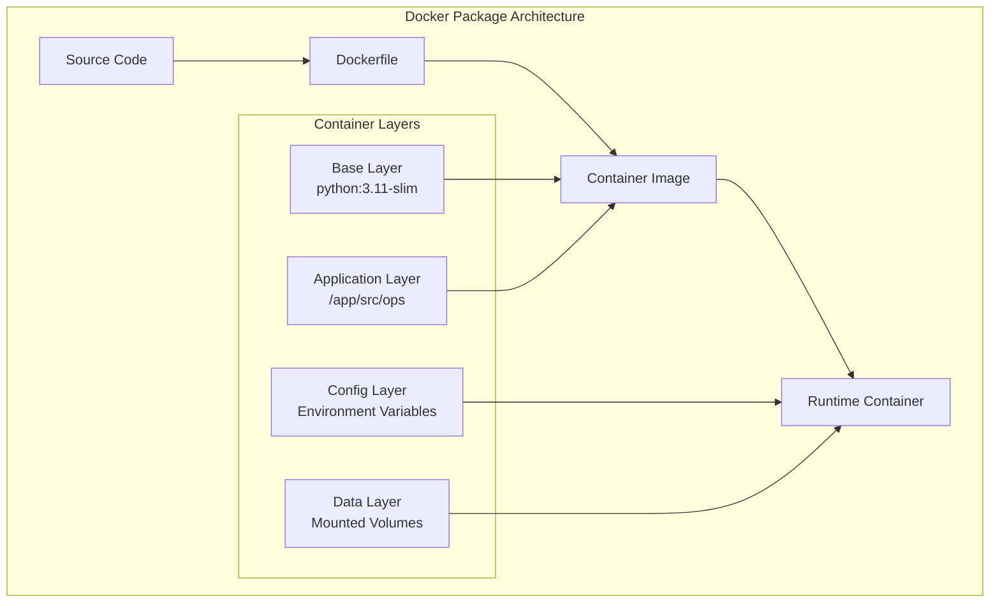
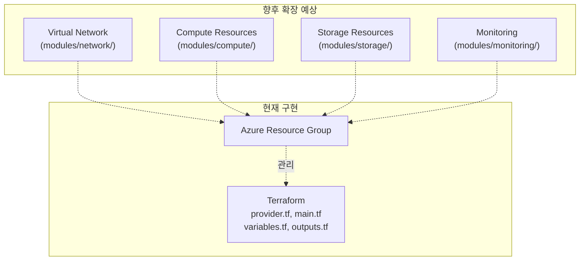
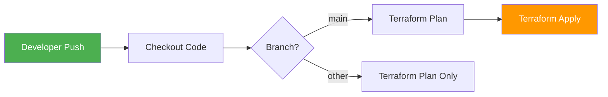
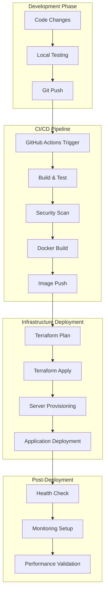
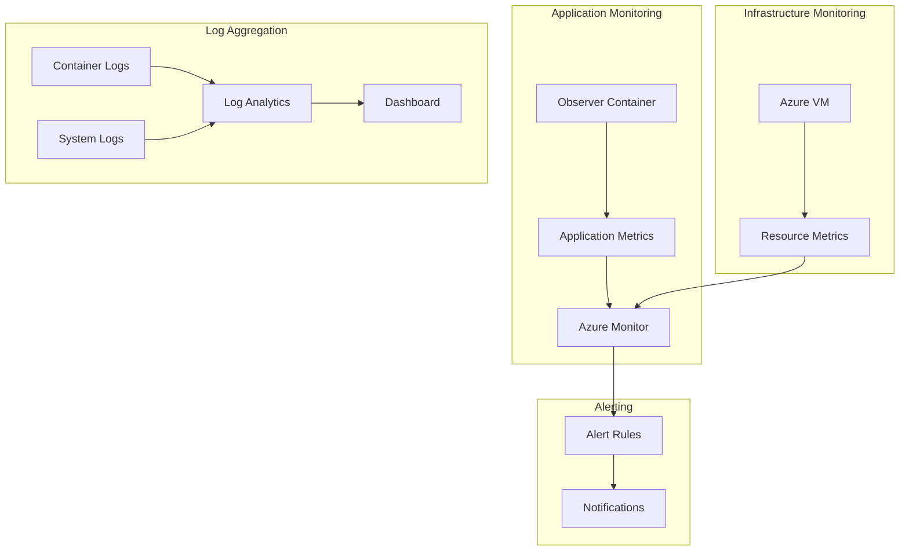

# QTS Ops 배포 아키텍처 가이드

**버전:** v1.1.0  
**작성일:** 2026-01-11  
**적용:** QTS Observer 시스템 배포  
**범위:** Docker 패키징부터 Terraform 인프라, CI/CD 자동화까지 전체 프로세스  
**상태:** 현재 실제 프로젝트 구현 기반

---

## 0. 아키텍처 개요

### 0.1 배포 철학

QTS Observer 배포 아키텍처는 **"Package → Deploy → Automate"** 3단계 철학을 따릅니다:

1. **Package**: Docker 컨테이너화로 애플리케이션 패키징 (`app/qts_ops_deploy/`)
2. **Deploy**: Terraform으로 Azure 인프라 프로비저닝 및 배포 (`infra/`)
3. **Automate**: GitHub Actions로 CI/CD 파이프라인 자동화 (`.github/workflows/`)

### 0.2 아키텍처 목표

- **재현성**: 동일한 환경에서 언제나 동일한 결과
- **자동화**: 수작업 최소화, 일관된 배포 프로세스
- **확장성**: 수평/수직 확장 및 추가 모듈 추가 용이
- **관찰성**: Observer 아키텍처(Snapshot, PatternRecord, EventBus)에 기반한 포괄적 데이터 수집

### 0.3 현재 구현 상태

- ✅ Docker: Dockerfile, docker-compose.yml 완성
- ✅ Terraform: 기본 구조 (provider.tf, backend.tf, main.tf, variables.tf, outputs.tf, modules/resource_group/)
- ✅ GitHub Actions: Terraform 배포 워크플로우 (terraform.yml)
- 🔄 향후 확장: Cloud-init, 복잡한 CI/CD, 다중 모듈화 등

---

## 1. Docker 패키징 아키텍처

### 1.1 컨테이너 설계 원칙



### 1.2 컨테이너 구조

#### **현재 디렉토리 레이아웃**
```
app/qts_ops_deploy/                    # Docker 배포 패키지
├── Dockerfile                          # Python 3.11 기반 Observer 이미지
├── docker-compose.yml                  # qts-observer 서비스 정의
├── start_ops.sh                        # 초기 시작 스크립트
├── MANIFEST.txt                        # 패키지 내용 목록
├── README.md                           # 배포 사용법
├── app/                                # 애플리케이션 소스
│   ├── observer.py                     # 메인 실행 파일
│   ├── paths.py                        # 경로 해석 모듈
│   ├── deployment_config.json          # 배포 설정
│   ├── data/observer/                  # 데이터 저장소 (볼륨 마운트)
│   ├── logs/                           # 로그 디렉토리 (볼륨 마운트)
│   ├── config/                         # 설정 파일 (볼륨 마운트)
│   └── src/                            # Observer 소스 코드
│       ├── automation/                 # 자동화 모듈
│       ├── backup/                     # 백업 모듈
│       ├── decision_pipeline/          # 의사결정 파이프라인
│       ├── logs/                       # 로깅 모듈
│       ├── maintenance/                # 유지보수 모듈
│       ├── observer/                   # 핵심 Observer 모듈
│       ├── retention/                  # 보존 정책 모듈
│       ├── runtime/                    # 런타임 모듈
│       ├── safety/                     # 안전 모듈
│       └── shared/                     # 공유 유틸리티
```

#### **Dockerfile (실제 구현)**
```dockerfile
FROM python:3.11-slim

WORKDIR /app

COPY observer.py /app/
COPY paths.py /app/
COPY src/ /app/src/

RUN mkdir -p /app/data/observer \
    && mkdir -p /app/logs \
    && mkdir -p /app/config

ENV QTS_OBSERVER_STANDALONE=1
ENV PYTHONPATH=/app/src:/app
ENV OBSERVER_DATA_DIR=/app/data/observer
ENV OBSERVER_LOG_DIR=/app/logs

RUN groupadd -r qts && useradd -r -g qts qts
RUN chown -R qts:qts /app
USER qts

HEALTHCHECK --interval=30s --timeout=10s --start-period=5s --retries=3 \
    CMD python -c "import sys; sys.exit(0)" || exit 1

EXPOSE 8000

CMD ["python", "observer.py"]
```

#### **docker-compose.yml (실제 구현)**
```yaml
version: '3.8'

services:
  qts-observer:
    build: .
    container_name: qts-observer
    restart: unless-stopped
    environment:
      - QTS_OBSERVER_STANDALONE=1
      - PYTHONPATH=/app/src:/app
      - OBSERVER_DATA_DIR=/app/data/observer
      - OBSERVER_LOG_DIR=/app/logs
    volumes:
      - ./data:/app/data/observer
      - ./logs:/app/logs
      - ./config:/app/config
    ports:
      - "8000:8000"
    networks:
      - qts-network

networks:
  qts-network:
    driver: bridge
```

#### **deployment_config.json (실제 구현)**

배포 시점의 설정을 저장하는 메타데이터 파일:
```json
{
    "deployment": {
        "version": "1.0.0",
        "created": "2026-01-11T08:08:07+09:00",
        "structure": "/app",
        "mode": "standalone"
    },
    "paths": {
        "data_dir": "/app/data/observer",
        "log_dir": "/app/logs",
        "config_dir": "/app/config"
    },
    "environment": {
        "QTS_OBSERVER_STANDALONE": "1",
        "PYTHONPATH": "/app/src:/app",
        "OBSERVER_DATA_DIR": "/app/data/observer",
        "OBSERVER_LOG_DIR": "/app/logs"
    }
}
```

**역할:**
- 배포 버전 및 생성 시간 기록
- 런타임 경로 명시
- 환경 변수 기본값 정의
- 배포 모드(standalone/integrated) 명시

#### **.dockerignore (권장)**
Docker 빌드 최적화를 위한 불필요한 파일 제외:
```
__pycache__
*.pyc
*.pyo
*.log
logs/
data/
.git
.gitignore
.env
*.md
test/
.pytest_cache
```

#### **requirements.txt (권장)**
Python 의존성 관리:
```
# 없으면 Dockerfile에서 pip install --no-cache-dir 없이 적용
# 향후 추가 시 다음과 같은 구조 권장:
# 
# # Core
# python >= 3.11
# 
# # Observer
# pandas>=1.5.0
# numpy>=1.24.0
# 
# # Logging
# python-json-logger>=2.0.0
# 
# # API (향후)
# fastapi>=0.100.0
# uvicorn>=0.23.0
```

### 1.3 배포 설정 및 환경 변수 명세

#### **환경 변수 상세**

| 변수명 | 기본값 | 용도 | 필수 | 수정 가능 |
|--------|--------|------|------|----------|
| QTS_OBSERVER_STANDALONE | 1 | Standalone 모드 활성화 | Yes | No |
| PYTHONPATH | /app/src:/app | Python 모듈 검색 경로 | Yes | No |
| OBSERVER_DATA_DIR | /app/data/observer | 데이터 저장 디렉토리 | Yes | Yes (경로) |
| OBSERVER_LOG_DIR | /app/logs | 로그 저장 디렉토리 | Yes | Yes (경로) |

#### **deployment_config.json 구조**

```
deployment_config.json
├── deployment
│   ├── version: 애플리케이션 버전
│   ├── created: 배포 생성 시간
│   ├── structure: 애플리케이션 루트 경로
│   └── mode: 실행 모드 (standalone/integrated)
├── paths
│   ├── data_dir: 데이터 저장소 경로
│   ├── log_dir: 로그 저장소 경로
│   └── config_dir: 설정 파일 경로
└── environment
    ├── QTS_OBSERVER_STANDALONE
    ├── PYTHONPATH
    ├── OBSERVER_DATA_DIR
    └── OBSERVER_LOG_DIR
```

#### **배포 설정 우선순위**

1. **실행 시 전달된 환경 변수** (최우선)
2. **docker-compose.yml의 environment**
3. **deployment_config.json의 environment**
4. **Dockerfile의 ENV** (기본값)

**예시:**
```bash
# 환경 변수로 재정의
DOCKER_CONTENT_TRUST=1 docker-compose run \
  -e OBSERVER_DATA_DIR=/mnt/data qts-observer
```

### 1.4 패키징 및 배포 프로세스

#### **배포 방법**

**방법 1: docker-compose 사용 (권장)**
```bash
cd app/qts_ops_deploy
docker-compose up -d
```

**방법 2: 수동 Docker 빌드**
```bash
cd app/qts_ops_deploy
docker build -t qts-observer:latest .
docker run -d \
  --name qts-observer \
  -e QTS_OBSERVER_STANDALONE=1 \
  -v $(pwd)/data:/app/data/observer \
  -v $(pwd)/logs:/app/logs \
  -v $(pwd)/config:/app/config \
  -p 8000:8000 \
  qts-observer:latest
```

**방법 3: 압축 패키지 배포**
```bash
# 패키지 생성
cd app/
./deploy_ops.sh
# → qts_ops_deploy.tar.gz 생성

# 원격 배포
scp qts_ops_deploy.tar.gz user@host:/opt/
ssh user@host "cd /opt && tar -xzf qts_ops_deploy.tar.gz && cd qts_ops_deploy && docker-compose up -d"
```

#### **배포 후 검증 체크리스트**

**즉시 확인 (배포 직후)**
```bash
# 1. 컨테이너 상태 확인
docker ps
# → qts-observer 컨테이너가 Up 상태인지 확인

# 2. 초기 로그 확인 (처음 30초)
docker logs qts-observer
# → 에러 메시지 없는지 확인

# 3. 환경 변수 확인
docker exec qts-observer printenv | grep OBSERVER
# → QTS_OBSERVER_STANDALONE, PYTHONPATH 등 정상 설정인지 확인

# 4. 볼륨 마운트 확인
docker exec qts-observer ls -la /app/data/observer
docker exec qts-observer ls -la /app/logs
# → 디렉토리가 존재하고 쓰기 권한이 있는지 확인
```

**5분 후 확인 (안정성)**
```bash
# 5. 컨테이너 재시작 여부 확인
docker ps --all | grep qts-observer
# → Restart Count가 0이어야 함

# 6. 로그 스트림 확인
docker logs -f qts-observer &
sleep 30
kill %1
# → 지속적으로 정상 동작하는지 확인

# 7. 데이터 파일 생성 확인
ls -lah data/observer/
ls -lah logs/
# → 최근 파일이 생성되었는지 확인
```

**운영 중 주기적 확인 (매일)**
```bash
# 8. 디스크 사용량 확인
docker exec qts-observer df -h /app
# → 여유 공간이 80% 이상 사용 중이면 알림

# 9. 메모리 사용량 확인
docker stats qts-observer --no-stream
# → 메모리 사용량이 정상 범위인지 확인

# 10. 최근 에러 로그 확인
docker logs qts-observer | grep -i error | tail -20
# → 에러 발생 여부 확인
```

---

## 2. Terraform 인프라 아키텍처

### 2.1 인프라 설계 원칙

현재 구현은 Azure에서 Resource Group 기반 리소스 관리의 기초를 제공합니다:



### 2.2 현재 Terraform 구조

#### **루트 디렉토리 구조 (실제 구현)**
```
.terraform/                            # (루트) Terraform 상태 및 provider
├── modules/                           
├── providers/                        
└── terraform.tfstate                 

infra/                                 # 인프라 IaC 코드
├── main.tf                           # 리소스 정의 (resource_group 모듈 사용)
├── variables.tf                      # 입력 변수 (resource_group_name, location, admin_password)
├── outputs.tf                        # 출력값 (resource_group_id)
├── provider.tf                       # Azure 프로바이더 설정 (subscription_id, tenant_id)
├── backend.tf                        # 원격 상태 저장소 설정 (Azure Storage)
├── terraform.tfvars.example          # 변수값 예시
├── .terraform.lock.hcl               # 프로바이더 버전 잠금
├── README.md                         # 사용법
├── modules/
│   └── resource_group/               # 리소스 그룹 모듈
│       ├── main.tf
│       ├── variables.tf
│       └── outputs.tf
├── scripts/
│   └── deploy_to_infrastructure.sh   # 배포 스크립트
└── docs/                             # (이동됨) docs/로 이동됨
```

#### **핵심 파일 (실제 구현)**

**infra/provider.tf** - Azure 프로바이더 설정
```hcl
terraform {
  required_providers {
    azurerm = {
      source  = "hashicorp/azurerm"
      version = ">= 3.0.0"
    }
  }
  required_version = ">= 1.0.0"
}

provider "azurerm" {
  features {}
  subscription_id = "632e6f30-269e-42d2-96a5-9c3618bd358e"
  tenant_id       = "cbd7850b-7a48-4769-80f5-3b08ab27243f"
}
```

**infra/backend.tf** - 원격 상태 저장
```hcl
terraform {
  backend "azurerm" {
    resource_group_name  = "rg-observer-test"
    storage_account_name = "observerstorage"
    container_name       = "tfstate"
    key                  = "terraform.tfstate"
  }
}
```

**infra/main.tf** - 리소스 정의
```hcl
module "resource_group" {
  source   = "./modules/resource_group"
  name     = var.resource_group_name
  location = var.location
}
```

**infra/variables.tf** - 변수 정의
```hcl
variable "resource_group_name" {
  description = "리소스 그룹 이름"
  type        = string
  default     = "rg-observer-test"
}

variable "location" {
  description = "Azure 리전"
  type        = string
  default     = "Korea South"
}

variable "admin_password" {
  description = "관리자 비밀번호 (민감 정보)"
  type        = string
  sensitive   = true
  default     = null
}
```

**infra/outputs.tf** - 출력값 정의
```hcl
output "resource_group_id" {
  description = "생성된 리소스 그룹의 ID"
  value       = module.resource_group.id
}
```

**infra/modules/resource_group/main.tf** - 모듈 구현
```hcl
resource "azurerm_resource_group" "rg" {
  name     = var.name
  location = var.location

  tags = {
    environment = "test"
    project     = "qts-observer"
  }
}
```

### 2.3 인프라 배포 프로세스

#### **1단계: Terraform 초기화**
```bash
cd infra
terraform init
```

#### **2단계: 배포 계획**
```bash
terraform plan -var-file="terraform.tfvars"
```

#### **3단계: 인프라 적용**
```bash
terraform apply -var-file="terraform.tfvars" -auto-approve
```

#### **4단계: 출력값 확인**
```bash
terraform output

# 예상 결과:
# resource_group_id = "/subscriptions/.../resourceGroups/rg-observer-test"
```

---

## 3. GitHub Actions CI/CD 아키텍처

### 3.1 현재 파이프라인 설계



### 3.2 워크플로우 구현 (실제)

#### **메인 워크플로우 (`.github/workflows/terraform.yml`)**
```yaml
name: Terraform CI

on:
  push:
    branches:
      - main
  pull_request:
    branches:
      - main

jobs:
  terraform:
    runs-on: ubuntu-latest
    env:
      ARM_SUBSCRIPTION_ID: ${{ secrets.ARM_SUBSCRIPTION_ID }}
      ARM_TENANT_ID: ${{ secrets.ARM_TENANT_ID }}
      ARM_CLIENT_ID: ${{ secrets.ARM_CLIENT_ID }}
      ARM_CLIENT_SECRET: ${{ secrets.ARM_CLIENT_SECRET }}
    steps:
      - name: Checkout code
        uses: actions/checkout@v4
      
      - name: Set up Terraform
        uses: hashicorp/setup-terraform@v3
      
      - name: Terraform Init
        run: terraform init
      
      - name: Terraform Plan
        run: terraform plan -var-file="terraform.tfvars"
      
      - name: Terraform Apply
        if: github.ref == 'refs/heads/main' && github.event_name == 'push'
        run: terraform apply -var-file="terraform.tfvars" -auto-approve
```

### 3.3 필수 GitHub Secrets 설정

GitHub Repository Secrets에 다음을 등록:
```
ARM_SUBSCRIPTION_ID    # Azure Subscription ID
ARM_TENANT_ID          # Azure Tenant ID
ARM_CLIENT_ID          # Azure Service Principal Client ID
ARM_CLIENT_SECRET      # Azure Service Principal Client Secret
```
          terraform_version: ${{ env.TERRAFORM_VERSION }}
      
      - name: Terraform Init
        run: |
          cd terraform
          terraform init -input=false
      
      - name: Terraform Plan
        run: |
          cd terraform
          terraform plan -input=false \
            -var-file="environments/staging.tfvars" \
            -var="docker_image=${{ needs.build.outputs.image }}" \
            -out=tfplan
      
      - name: Terraform Apply
        run: |
          cd terraform
          terraform apply -input=false -auto-approve tfplan
      
      - name: Deploy Application
        run: |
          # SSH를 통해 서버에 배포 스크립트 실행
          ssh -o StrictHostKeyChecking=no ${{ secrets.STAGING_SSH_USER }}@${{ secrets.STAGING_HOST }} \
            "cd /opt/qts-observer && ./scripts/deploy_to_infrastructure.sh"

  deploy-production:
    runs-on: ubuntu-latest
    needs: build
    if: github.ref == 'refs/heads/main'
    environment: production
    
    steps:
      - name: Checkout code
        uses: actions/checkout@v4
      
      - name: Setup Terraform
        uses: hashicorp/setup-terraform@v3
        with:
          terraform_version: ${{ env.TERRAFORM_VERSION }}
      
      - name: Terraform Init
        run: |
          cd terraform
          terraform init -input=false
      
      - name: Terraform Plan
        run: |
          cd terraform
          terraform plan -input=false \
            -var-file="environments/prod.tfvars" \
            -var="docker_image=${{ needs.build.outputs.image }}" \
            -out=tfplan
      
      - name: Terraform Apply
        run: |
          cd terraform
          terraform apply -input=false -auto-approve tfplan
      
      - name: Deploy Application
        run: |
          ssh -o StrictHostKeyChecking=no ${{ secrets.PROD_SSH_USER }}@${{ secrets.PROD_HOST }} \
            "cd /opt/qts-observer && ./scripts/deploy_to_infrastructure.sh"

  # 헬스체크 및 모니터링
  health-check:
    runs-on: ubuntu-latest
    needs: [deploy-staging, deploy-production]
    if: always()
    
    steps:
      - name: Health Check Staging
        if: needs.deploy-staging.result == 'success'
        run: |
          echo "Checking staging deployment..."
          curl -f ${{ secrets.STAGING_URL }}/health || exit 1
      
      - name: Health Check Production
        if: needs.deploy-production.result == 'success'
        run: |
          echo "Checking production deployment..."
          curl -f ${{ secrets.PROD_URL }}/health || exit 1
      
      - name: Notify Success
        if: success()
        run: |
          echo "✅ Deployment successful!"
          # Slack/Teams notification here
      
      - name: Notify Failure
        if: failure()
        run: |
          echo "❌ Deployment failed!"
          # Slack/Teams notification here
```

---

## 4. 통합 배포 프로세스

### 4.1 전체 배포 흐름



### 4.2 실제 배포 실행

#### **로컬 개발 환경**
```bash
# 1. 패키징
./deploy_ops.sh

# 2. 로컬 테스트
cd qts_ops_deploy
docker-compose up -d

# 3. 헬스체크
curl http://localhost:8000/health
```

#### **인프라 배포**
```bash
# 1. Terraform 배포
cd terraform
terraform init
terraform plan -var-file="environments/prod.tfvars"
terraform apply -var-file="environments/prod.tfvars"

# 2. 애플리케이션 배포
./scripts/deploy_to_infrastructure.sh
```

#### **자동화 배포**
```bash
# 1. 코드 푸시
git add .
git commit -m "feat: update observer functionality"
git push origin main

# 2. GitHub Actions 자동 실행
# - 테스트 실행
# - Docker 빌드 및 푸시
# - Terraform 인프라 배포
# - 애플리케이션 배포
# - 헬스체크
```

---

## 5. 모니터링 및 운영

### 5.1 모니터링 아키텍처



### 5.2 핵심 모니터링 지표

#### **애플리케이션 메트릭**
- 스냅샷 처리 지연 시간
- 버퍼 활용률
- 에러율
- 처리량

#### **인프라 메트릭**
- CPU 사용률
- 메모리 사용량
- 디스크 I/O
- 네트워크 대역폭

#### **비즈니스 메트릭**
- 데이터 처리량
- 세션 수
- 가용성

### 5.3 알림 설정

```yaml
# Azure Monitor Alert Rules
alerts:
  - name: "High CPU Usage"
    condition: "cpu_percentage > 80"
    duration: "5m"
    severity: "warning"
  
  - name: "Container Down"
    condition: "container_status == 'stopped'"
    duration: "1m"
    severity: "critical"
  
  - name: "High Error Rate"
    condition: "error_rate > 5%"
    duration: "2m"
    severity: "warning"
```

---

## 6. 보안 및 규정 준수

### 6.1 보안 레이어

```mermaid
graph TB
    subgraph "Network Security"
        A[Network Security Group]
        B[Private Endpoints]
        C[DDoS Protection]
    end
    
    subgraph "Identity Security"
        D[Managed Identity]
        E[Azure AD]
        F[RBAC]
    end
    
    subgraph "Data Security"
        G[Encryption at Rest]
---

## 3.4 Observer 아키텍처와의 연계

**QTS Observer 핵심 아키텍처 (docs/ops_Architecture.md 기준):**

```
Observer Architecture Layer (앱 레벨)
├── Snapshot: 시장/시스템 이벤트 관찰
├── PatternRecord: 스냅샷을 패턴으로 변환
├── EventBus: 패턴을 이벤트로 배포
└── Judgment/Blocking/Non-execution: 판단 데이터 기록
         ↓
Deployment Layer (배포 레벨)
├── Docker: 독립적 실행 (standalone)
├── Volumes: 데이터/로그 지속성
├── Environment Variables: 런타임 설정
└── Health Check: 상태 모니터링
         ↓
Infra Layer (인프라 레벨)
├── Azure Resource Group: 리소스 관리
├── Terraform: 인프라 코드화
└── GitHub Actions: 자동화 배포
```

**배포 시 고려사항:**

1. **데이터 지속성**: Volumes는 Snapshot/PatternRecord 데이터 보존
2. **로그 지속성**: 판단(Judgment), 차단(Blocking), 비실행(Non-execution) 기록 보존
3. **환경 변수**: Observer 코어(Standalone 모드)와 런타임 경로 일관성 유지
4. **재현성**: 동일한 deployment_config.json으로 동일한 상태 재현

**체크리스트:**
- [ ] Observer 코드와 배포 설정의 경로(paths.py, deployment_config.json) 일치
- [ ] Standalone 모드 환경 변수(QTS_OBSERVER_STANDALONE=1) 설정
- [ ] 데이터/로그 볼륨 마운트 경로 확인
- [ ] 배포 후 obs_Architecture.md의 "Observer Role & Responsibility" 준수 확인

---

## 4. 모니터링 및 로깅

### 4.1 현재 로깅 구조

#### **로그 수집 경로**
```
Container Logs
    ↓
docker logs qts-observer
    ↓
volumes/logs/
    ↓
로컬 또는 Azure Storage 백업
```

#### **로그 확인 방법**
```bash
# 실시간 로그
docker logs -f qts-observer

# 이전 로그 조회
docker logs --since 1h qts-observer

# 로컬 볼륨에서 로그 확인
cat logs/observer.log
```

### 4.2 향후 확장 모니터링

**권장 사항:**
- Azure Monitor 통합
- Application Insights 연동
- 알림 규칙 설정 (CPU, 메모리, 디스크)
- 메트릭 대시보드 구성

---

## 5. 보안

### 5.1 현재 보안 구현

#### **컨테이너 보안**
- 비-root 사용자 실행 (qts)
- 헬스체크 활성화
- 환경 변수로 민감 정보 관리

#### **인프라 보안**
- 프로바이더에서 subscription_id, tenant_id 명시
- terraform.tfvars 파일 .gitignore 처리
- Azure Storage에 원격 상태 저장

### 5.2 권장 보안 강화

- SSH 키 기반 인증만 허용
- 네트워크 보안 그룹(NSG) 추가
- Azure Key Vault 통합
- 정기적인 취약점 스캔

---

## 6. 트러블슈팅

### 6.1 일반적인 문제

#### **Docker 컨테이너가 시작되지 않음**
```bash
# 로그 확인
docker logs qts-observer

# 이미지 확인
docker images

# 컨테이너 상태 확인
docker ps -a

# 컨테이너 강제 재시작
docker-compose restart
```

#### **Terraform 배포 실패**
```bash
# 상태 파일 확인
terraform show

# 최신 상태 확인
terraform refresh

# 구체적 리소스만 배포
terraform apply -target=module.resource_group
```

### 6.2 포트 충돌
```bash
# 포트 사용 확인
netstat -an | grep 8000

# 기존 프로세스 종료
kill -9 <PID>

# Docker로 다른 포트 사용
docker run -p 8001:8000 qts-observer:latest
```

---

## 7. 배포 최적화 가이드

### 7.1 Docker 이미지 최적화

#### **빌드 속도 개선**
```bash
# .dockerignore 활용으로 캐시 크기 감소
docker build --build-arg BUILDKIT_INLINE_CACHE=1 \
  -t qts-observer:latest .

# BuildKit 사용 (빠른 빌드)
DOCKER_BUILDKIT=1 docker build -t qts-observer:latest .
```

#### **이미지 크기 축소**
```dockerfile
# 멀티스테이지 빌드 (향후)
FROM python:3.11 as builder
RUN pip install --user --no-cache-dir -r requirements.txt

FROM python:3.11-slim
COPY --from=builder /root/.local /root/.local
```

### 7.2 런타임 최적화

#### **메모리 제한**
```yaml
# docker-compose.yml에 추가
services:
  qts-observer:
    # ... 기존 설정 ...
    deploy:
      resources:
        limits:
          cpus: '1.0'
          memory: 512M
        reservations:
          cpus: '0.5'
          memory: 256M
```

#### **로그 로테이션**
```yaml
# docker-compose.yml
services:
  qts-observer:
    logging:
      driver: "json-file"
      options:
        max-size: "10m"
        max-file: "3"
```

### 7.3 보안 강화

#### **읽기 전용 루트 파일시스템**
```yaml
# docker-compose.yml
services:
  qts-observer:
    read_only: true
    tmpfs:
      - /app/logs  # 임시 로그 디렉토리
```

#### **네트워크 격리**
```yaml
# docker-compose.yml
services:
  qts-observer:
    networks:
      - qts-network

networks:
  qts-network:
    driver: bridge
    driver_opts:
      com.docker.network.bridge.name: br-qts
```

---

## 8. 배포 의사결정 플로우

```
배포 요청
    ↓
1. 패키지 검증
   ├─ MANIFEST.txt 확인
   ├─ deployment_config.json 확인
   └─ 필수 파일 존재 확인
    ↓
2. Docker 빌드 (dev)
   ├─ .dockerignore 활용
   ├─ 빌드 성공 확인
   └─ 로컬 테스트
    ↓
3. Terraform 인프라 확인
   ├─ terraform.tfvars 준비
   ├─ terraform plan 검증
   └─ 리소스 충돌 확인
    ↓
4. 배포 실행 (선택)
   ├─ Docker: docker-compose up -d
   └─ Terraform: terraform apply
    ↓
5. 배포 후 검증
   ├─ 컨테이너 상태 확인
   ├─ 데이터/로그 볼륨 확인
   ├─ Observer 아키텍처 준수 확인
   └─ 성능 메트릭 기록
    ↓
배포 완료
```

---

## 9. 참고 문서

- [docs/ops_Architecture.md](ops_Architecture.md) - Observer 아키텍처 기본 (Snapshot, PatternRecord, EventBus)
- [docs/todo/todo.md](todo/todo.md) - 현재 진행 상황 및 투두
- [infra/README.md](../infra/README.md) - Terraform 상세 가이드
- [app/qts_ops_deploy/README.md](../app/qts_ops_deploy/README.md) - Docker 배포 가이드
- [.github/workflows/terraform.yml](../.github/workflows/terraform.yml) - GitHub Actions 워크플로우

## 10. 최종 배포 체크리스트

### 배포 전 확인사항

**Docker 배포:**
- [ ] app/qts_ops_deploy 폴더 준비 확인
- [ ] Dockerfile, docker-compose.yml 파일 존재
- [ ] deployment_config.json 경로/설정 일치
- [ ] 불필요한 캐시(__pycache__, *.log) 제거 완료
- [ ] .dockerignore 파일 존재 및 활성화
- [ ] docker-compose up -d 로컬 테스트 성공

**Terraform 배포:**
- [ ] Azure 구독/테넌트 ID 확인
- [ ] terraform.tfvars 파일 생성 및 값 입력
- [ ] backend.tf의 저장소 계정 존재 확인
- [ ] terraform init, plan 성공 확인
- [ ] terraform apply 승인 대기

**GitHub Actions:**
- [ ] ARM_SUBSCRIPTION_ID, ARM_TENANT_ID, ARM_CLIENT_ID, ARM_CLIENT_SECRET Secrets 등록
- [ ] terraform.yml 워크플로우 활성화
- [ ] main 브랜치 push 테스트

**배포 후 검증:**
- [ ] 컨테이너 상태 확인 (docker ps)
- [ ] 로그 확인 (docker logs qts-observer)
- [ ] 환경 변수 확인 (docker exec ... printenv | grep OBSERVER)
- [ ] 데이터/로그 볼륨 확인
- [ ] Observer 아키텍처 준수 확인
- [ ] 성능 메트릭 기록 (cpu, memory, disk)

---

**마지막 업데이트:** 2026-01-11 (v1.1.0 → v1.2.0)

**주요 보완사항:**
- deployment_config.json 구조 및 역할 명시
- .dockerignore 및 requirements.txt 가이드라인 추가
- 배포 후 검증 체크리스트 (즉시/5분/매일) 추가
- 환경 변수 명세 표 추가
- Observer 아키텍처와의 연계 명확화
- 배포 최적화 및 보안 강화 가이드 추가
- 배포 의사결정 플로우 다이어그램 추가
- 최종 배포 체크리스트 통합
- 네트워크 최적화

#### **스케일링 전략**
- 수평 스케일링 (로드 밸런싱)
- 수직 스케일링 (VM 크기 조정)
- 오토 스케일링 설정

---

## 9. 문제 해결 가이드

### 9.1 일반적인 문제

#### **컨테이너 시작 실패**
```bash
# 로그 확인
docker logs qts-observer

# 디버깅 모드 실행
docker run -it --entrypoint /bin/bash qts-observer:latest
```

#### **인프라 배포 실패**
```bash
# Terraform 상태 확인
terraform show

# 리소스 상태 확인
terraform plan -detailed-exitcode
```

#### **성능 문제**
```bash
# 리소스 사용량 확인
docker stats qts-observer

# 프로파일링
python -m cProfile observer.py
```

### 9.2 진단 도구

#### **시스템 진단**
```bash
# 시스템 상태
docker exec qts-observer df -h
docker exec qts-observer ps aux
docker exec qts-observer netstat -tlnp
```

#### **애플리케이션 진단**
```bash
# 애플리케이션 상태
curl http://localhost:8000/health
docker exec qts-observer python -c "from ops.observer.deployment_paths import get_deployment_info; print(get_deployment_info())"
```

---

## 10. 결론

### 10.1 아키텍처 성과

QTS Ops 배포 아키텍처를 통해 다음을 달성했습니다:

1. **완전 자동화**: 코드 푸시부터 프로덕션 배포까지 전체 자동화
2. **재현성**: 동일한 환경에서 일관된 배포 결과 보장
3. **확장성**: 수평/수직 확장이 용이한 아키텍처
4. **모니터링**: 포괄적인 관찰 가능성 및 알림 시스템
5. **보안**: 다계층 보안 및 규정 준수

### 10.2 향후 개선 방향

1. **멀티 클라우드 지원**: AWS, GCP 확장
2. **쿠버네티스 도입**: 컨테이너 오케스트레이션
3. **서비스 메시**: Istio 도입
4. **AI/ML 기반 모니터링**: 이상 탐지 자동화
5. **그린 컴퓨팅**: 에너지 효율 최적화

---

## 11. 부록

### 11.1 유용한 명령어 모음

```bash
# Docker 관련
docker build -t qts-observer:latest .
docker-compose up -d
docker logs -f qts-observer
docker stats qts-observer

# Terraform 관련
terraform init
terraform plan -var-file="environments/prod.tfvars"
terraform apply -var-file="environments/prod.tfvars"
terraform destroy -var-file="environments/prod.tfvars"

# 모니터링 관련
curl http://localhost:8000/health
az monitor metrics list --resource $RESOURCE_ID
az monitor activity-log list
```

### 11.2 환경 변수 참조

```bash
# 애플리케이션 환경 변수
export QTS_OBSERVER_STANDALONE=1
export PYTHONPATH=/app/src:/app
export OBSERVER_DATA_DIR=/app/data/observer
export OBSERVER_LOG_DIR=/app/logs

# 인프라 환경 변수
export ARM_CLIENT_ID=$AZURE_CLIENT_ID
export ARM_CLIENT_SECRET=$AZURE_CLIENT_SECRET
export ARM_SUBSCRIPTION_ID=$AZURE_SUBSCRIPTION_ID
export ARM_TENANT_ID=$AZURE_TENANT_ID
```

---


---

## Changelog

- **2026-01-11**: 멀티스테이지 빌드, 리소스 제한, 로그 로테이션, 배포 후 검증 체크리스트, 보안 강화, IaC 동기화, 수동 점검 항목 등 1~10번 실무 최적화 내용 반영

**문서 버전:** v1.1.0  
**마지막 업데이트:** 2026-01-11  
**다음 리뷰:** 2026-01-25
