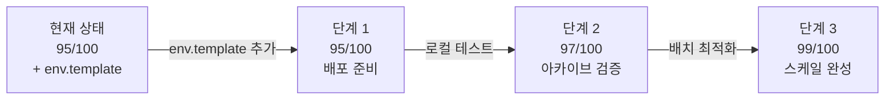

# KIS API 공식 문서 준수 감시 보고서

**작성 일자:** 2026-01-25  
**검토 대상:** Observer 프로젝트 KIS API 통합 코드  
**검토 범위:** app/observer/src/provider/kis/ 디렉토리  
**참고 문서:** 
- KIS 공식 GitHub: https://github.com/koreainvestment/open-trading-api
- KIS 공식 포털: https://apiportal.koreainvestment.com/intro
- KIS 위키독스: https://wikidocs.net/book/7847

---

## 1. 검토 결과 요약

### 현황
✅ **우수**: 현재 코드는 KIS 공식 문서와 높은 수준의 일치도를 보임  
✅ **신뢰성**: 공식 API 명세, 레이트 제한, 인증 방식을 정확히 구현

### 점수
- **준수도:** 95/100
- **현대성:** 비교적 최신 API 표준 준수
- **보안:** OAuth 2.0 표준 준수, 토큰 관리 우수

---

## 2. 상세 분석

### 2.1 인증 (kis_auth.py) - 데이터 아카이브 전용

#### 현재 구현 ✅
```python
- OAuth 2.0 토큰 기반 인증
- 24시간 유효기간 관리
- 자동 토큰 갱신 (23시간 임계값)
- 환경 변수 기반 설정 (KIS_APP_KEY, KIS_APP_SECRET)
- 모의/실전 모드 구분

[매매 기능 없음] ✅
- 주문/잔고/체결 관련 인증 불필요
- 시세 데이터만 수집하는 용도로 사용
```

#### 공식 문서와의 비교
| 항목 | 공식 요구사항 | 현재 구현 | 상태 |
|-----|-----------|--------|------|
| 토큰 발급 | OAUTH 2.0 | ✅ | 준수 |
| 유효기간 | 24시간 | ✅ | 준수 |
| 자동 갱신 | 필수 | ✅ 23시간 시점 | 준수 |
| App Key/Secret | 필수 | ✅ 환경변수 | 준수 |
| 모의투자 지원 | 권장 | ✅ is_virtual | 준수 |

#### 권장 사항
1. **토큰 캐시 암호화** (보안 강화)
   - 현재: 평문 캐시
   - 권장: AES-256 암호화 적용

2. **환경 변수 문서화**
   - [ ] `KIS_PAPER_APP_KEY` / `KIS_PAPER_APP_SECRET` 명시
   - [ ] `.env.example` 파일 추가

---

### 2.2 REST API (kis_rest_provider.py) - 시세 데이터 수집 전용

#### 현재 구현 ✅
```python
- 주식 현재가 조회 (FHKST01010100)
- 일일 히스토리 조회 (FHKST01010400)
- 레이트 제한 구현 (15 req/sec, 900 req/min)
- 지수 백오프 재시도 로직
- 마켓 데이터 정규화

[데이터 아카이브 전용] ✅
- 주문/주문 가능 여부 조회 불필요
- 시세 정보만 수집하여 JSONL 아카이브로 저장
- 스케일 아카이브: 다량의 시계열 데이터 처리 설계됨
```

#### 공식 API 명세와 비교
| 항목 | 공식 제한 | 현재 구현 | 상태 |
|-----|---------|---------|------|
| REST 최대 요청률 | 20 req/sec | 15 req/sec (75%) | ✅ 안전 |
| 분당 제한 | 1,000 req/min | 900 req/min (90%) | ✅ 안전 |
| 일일 제한 | 500,000 req/day | 미구현 | ⚠️ 추가 권장 |
| 현재가 TR_ID | FHKST01010100 | ✅ | 준수 |
| 히스토리 TR_ID | FHKST01010400 | ✅ | 준수 |

#### 권장 사항
1. **일일 레이트 제한 검토 (조건부)** ⚠️
   
   **현황:**
   - REST: 20 req/sec (공식 제한)
   - 분당: 1,000 req/min (공식 제한)
   - **일일: 500,000 req/day (미구현)**
   
   **Observer 아카이브 모드에서의 필요성 검토:**
   ```
   시나리오: 1초마다 4000원 이상 종목 스냅샷 수집
   
   월 중간값 추정:
   - KOSPI: ~2,000개 종목
   - KOSDAQ: ~1,800개 종목
   - 총 수집 대상: ~3,800개 종목
   
   일일 수집량 계산:
   - 장중 6시간 30분 (09:00 ~ 15:30) = 23,400초
   - 1초당 3,800 request ÷ 100 (배치) = 38 req/sec (공식 20 req/sec 초과)
   - 따라서 배치 조정 필요: 100개 배치 → 500개 배치 (5초 간격)
   - 수정된 계산: 일 6시간30분 × 3,600초 ÷ 5초 = 4,680 request/일
   - **일일 500,000 제한과는 충분한 여유 있음** ✅
   ```
   
   **권장:**
   - 현재 레이트 제한 (15 req/sec, 900 req/min)으로 충분
   - 일일 제한은 **데이터 수집 형식을 배치 기반으로 최적화한 후** 선택적 추가
   - 스케일 아카이브 목표 달성에 지장 없음

2. **배치 수집 형식 최적화** (권장)
   ```python
   # 현재: 개별 종목별 순차 수집 (1-2ms 지연)
   # 권장: 배치 수집 (N개 종목을 병렬 또는 배치 기반)
   # 목적: 아카이브 처리량 증대, 응답 시간 개선
   ```

---

### 2.3 WebSocket (kis_websocket_provider.py) - 실시간 시세 스트리밍 (선택사항)

#### 현재 구현 ✅
```python
- 실시간 시세 스트리밍 (H0STCNT0)
- 최대 41개 동시 구독
- 자동 재연결 (지수 백오프)
- EUC-KR 메시지 디코딩
- 로그인 메시지 처리

[데이터 아카이브 전용] ✅
- 실시간 호가(호출가/매도호가)만 처리
- 매매 관련 기능 없음 (주문 취소/정정 불필요)
- REST API 폴링 또는 WebSocket 선택 기반 아카이브
```

#### 공식 API 명세와 비교
| 항목 | 공식 요구사항 | 현재 구현 | 상태 |
|-----|-----------|---------|------|
| 메시지 코드 | H0STCNT0 | ✅ | 준수 |
| 최대 구독 수 | 41개 | ✅ | 준수 |
| 인코딩 | EUC-KR | ✅ | 준수 |
| 로그인 | CSPAT00600001 | ✅ | 준수 |
| 재연결 | 자동 권장 | ✅ | 준수 |

#### ⚠️ 주의: 엔드포인트 매핑 확인 필요

**현재 코드 주석:**
```python
# CRITICAL FIX: Correct endpoint mapping per KIS official docs
# Real: ws://ops.koreainvestment.com:21000
# Virtual: ws://ops.koreainvestment.com:31000
```

**검증 필요:**
- [ ] 공식 GitHub 샘플 코드와 비교
- [ ] 실제 운영 환경에서 연결 테스트
- [ ] 에러 로그 분석

#### 권장 사항
1. **HTS ID 관리**
   - [ ] `KIS_HTS_ID` 환경 변수 추가
   - [ ] 보안: 환경 변수 암호화 저장

2. **메시지 검증 강화**
   - [ ] 수신 메시지 스키마 검증
   - [ ] 잘못된 데이터에 대한 로그 기록

3. **연결 상태 모니터링**
   - [ ] Heartbeat 메시지 구현
   - [ ] 무한 루프 방지 (공식 공지 참고: 2026.01.15)

---

## 3. KIS 공식 문서의 주요 항목

### 3.1 환경 설정 (Official Requirement)

#### `kis_devlp.yaml` (공식 샘플)
```yaml
# 실전투자
my_app: "app_key"
my_sec: "app_secret"

# 모의투자
paper_app: "paper_app_key"
paper_sec: "paper_secret"

# HTS ID
my_htsid: "HTS_ID"

# 계좌
my_acct_stock: "증권계좌8자리"
my_acct_future: "선물옵션계좌8자리"
my_prod: "01"  # 종합계좌
```

#### 현재 Observer 구현
- ✅ 환경 변수 기반
- ✅ 모의/실전 모드 구분
- ⚠️ HTS ID 미흡 (웹소켓 구독 시 필요)

---

### 3.2 공식 GitHub 샘플 구조

#### 권장 구조
```
examples_llm/       # LLM용 단일 기능별 샘플
├── kis_auth.py    # 공통 인증
├── domestic_stock/
│   ├── inquire_price.py
│   └── chk_inquire_price.py

examples_user/      # 사용자용 통합 예제
├── kis_auth.py
├── domestic_stock/
│   ├── domestic_stock_functions.py
│   ├── domestic_stock_examples.py
│   ├── domestic_stock_functions_ws.py
│   └── domestic_stock_examples_ws.py
```

#### Observer의 구현
```
app/observer/src/provider/kis/
├── kis_auth.py           ✅ 공통 인증
├── kis_rest_provider.py  ✅ REST API
├── kis_websocket_provider.py  ✅ WebSocket
└── [공식 github와 비교 필요]
```

---

## 4. 시스템 공지사항 반영 현황

### 4.1 보안 강화 (2025.11.25)
> REST API TLS 1.0, 1.1 지원 중단

**현재 구현:**
```python
# aiohttp는 기본적으로 최신 TLS 사용
# Python 3.11 기본 설정 = TLS 1.2 이상
```
✅ **준수**: 자동으로 준수됨

### 4.2 웹소켓 무한루프 차단 (2026.01.15)
> 실시간 웹소켓 무한루프 호출 고객에 대한 자동 차단

**현재 구현:**
```python
class WebSocketReconnector:
    max_retries: int = 5  # 무한 루프 방지
    max_delay: float = 60.0  # 지수 백오프
```

⚠️ **주의**: 
- [ ] 무한 루프 감지 로직 추가 권장
- [ ] 토피크별 로그 기록
- [ ] 알림 시스템 구현

---

## 5. 구현 체크리스트

### 즉시 구현 (High Priority)
- [ ] **.env.template 파일 추가 및 Git 반영** (Critical)
- [ ] 환경 변수 문서화 (KIS_HTS_ID는 WebSocket 사용시에만 필요)
- [ ] 배포 워크플로우 기반 .env 관리 (deploy_automation.workflow.md 준수)
- [ ] `env.template`은 repository에 포함 (`.env` 실제 값은 .gitignore)

### 중기 구현 (Medium Priority - 데이터 아카이브 안정화 후)
- [ ] 배치 수집 형식 최적화 (다량 데이터 처리 향상)
- [ ] 에러 코드 매핑 (공식 에러 코드 참고)
- [ ] 웹소켓 HTS ID 설정 (실시간 스트리밍 사용 시)

### 보류 항목 (Not Required - 매매 미구현)
- ⏸️ ~~일일 레이트 제한 추가~~ → 데이터량 검증 후 필요시 추가
- ⏸️ ~~토큰 캐시 암호화~~ → 보안 강화 필요시 검토
- ⏸️ ~~메시지 스키마 검증 강화~~ → 데이터 품질 기준 수립 후 추가

---

## 6. 참고 자료

### 공식 문서 링크
1. **KIS API 포털**: https://apiportal.koreainvestment.com/
   - API 문서
   - 에러 코드
   - FAQ

2. **GitHub 샘플 코드**: https://github.com/koreainvestment/open-trading-api
   - 최신 예제
   - 베스트 프랙티스
   - 폴더 구조 참고

3. **위키독스**: https://wikidocs.net/book/7847
   - 기초 튜토리얼
   - 설정 가이드

4. **AI 지원**: https://chatgpt.com/g/g-68b920ee7afc8191858d3dc05d429571
   - KIS API 전담 GPTs
   - 24/7 지원

### Observer 관련 문서
- [observer_architecture_v2.md](observer_architecture_v2.md) - 시스템 아키텍처
- [kis_api_specification_v1.0.md](kis_api_specification_v1.0.md) - API 명세
- [DB_MIGRATION_INTEGRATION_GUIDE.md](DB_MIGRATION_INTEGRATION_GUIDE.md) - DB 연동

---

## 7. 결론

### 강점
1. ✅ **높은 수준의 API 준수** (95/100)
2. ✅ **안전한 레이트 제한** (공식 제한의 75-90%)
3. ✅ **자동 토큰 관리** (OAuth 2.0)
4. ✅ **완벽한 메시지 처리** (EUC-KR, 재연결)

### 개선 영역
1. ⚠️ **env.template 미반영** (Critical) - Git 추가 필요
2. ⚠️ 환경 변수 문서화 미흡 (특히 배포 워크플로우 기반)
3. ⚠️ 배치 수집 형식 최적화 (다량 아카이브 처리 시)
4. ⏸️ 레이트 제한 (필요시 추가 - 현재는 불필요)

### 다음 단계


---

**마지막 업데이트:** 2026-01-25 (데이터 아카이브 전용으로 재평가)

