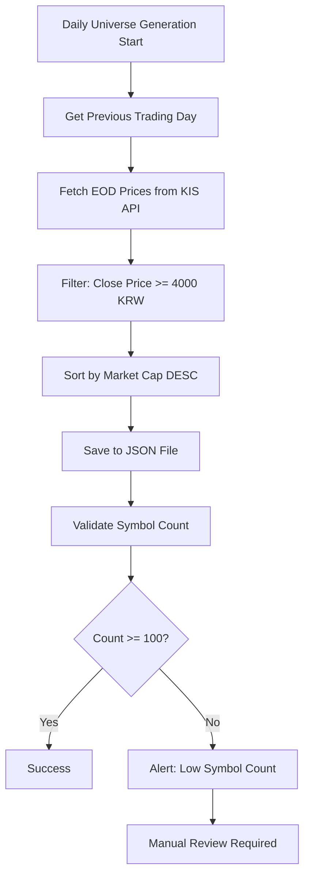

# Implementation Details Supplement

**Document ID**: SPEC-IMPL-DETAILS-001
**Version**: 1.0.0
**Date**: 2026-01-20
**Parent Document**: data_pipeline_architecture_observer_v1.0.md
**Purpose**: Major 이슈 (M-001 ~ M-005) 해결을 위한 구현 상세 정보
**Status**: Draft

---

## 1. Universe Manager 구현 상세 (M-001 해결)

### 1.1 일일 Universe 생성 플로우



### 1.2 구현 의사코드

```python
class UniverseManager:
    """
    Universe 관리자: 전일 종가 4,000원 이상 종목 선정
    """

    def __init__(self, provider_engine: ProviderEngine):
        self.provider = provider_engine
        self.cache: Dict[str, List[str]] = {}  # date -> symbols

    def create_daily_snapshot(self, target_date: str) -> Path:
        """
        일일 Universe 스냅샷 생성

        Args:
            target_date: 목표 날짜 (YYYYMMDD)

        Returns:
            생성된 스냅샷 파일 경로

        Raises:
            UniverseGenerationError: Universe 생성 실패 시
        """
        # Step 1: 전일 영업일 계산
        prev_trading_day = self._get_previous_trading_day(target_date)
        logger.info(f"Creating universe for {target_date}, using prev day: {prev_trading_day}")

        # Step 2: 전일 종가 데이터 조회
        try:
            eod_data = self._fetch_eod_prices(prev_trading_day)
        except APIError as e:
            logger.error(f"Failed to fetch EOD prices: {e}")
            # Fallback: 기존 Universe 재사용
            return self._use_previous_universe(target_date)

        # Step 3: 필터링 (종가 >= 4000원)
        filtered_symbols = [
            symbol for symbol, data in eod_data.items()
            if data['close'] >= 4000
        ]

        # Step 4: 시가총액 순 정렬 (선택적)
        sorted_symbols = self._sort_by_market_cap(filtered_symbols, eod_data)

        # Step 5: Validation
        if len(sorted_symbols) < 100:
            logger.warning(
                f"Low symbol count: {len(sorted_symbols)} (expected >= 100)"
            )
            self._send_alert(
                f"Universe generation warning: only {len(sorted_symbols)} symbols"
            )

        # Step 6: JSON 파일 저장
        snapshot_path = self._save_snapshot(target_date, sorted_symbols, prev_trading_day)

        # Step 7: 캐시 업데이트
        self.cache[target_date] = sorted_symbols

        logger.info(
            f"Universe created: {len(sorted_symbols)} symbols",
            extra={"date": target_date, "prev_day": prev_trading_day}
        )

        return snapshot_path

    def _get_previous_trading_day(self, date: str) -> str:
        """
        전일 영업일 계산

        Logic:
            - 월요일 -> 금요일 (3일 전)
            - 화~금요일 -> 1일 전
            - 공휴일 처리: KRX 휴장일 캘린더 참조
        """
        from datetime import datetime, timedelta

        dt = datetime.strptime(date, "%Y%m%d")
        weekday = dt.weekday()

        # 월요일 (0) -> 금요일로
        if weekday == 0:
            prev_day = dt - timedelta(days=3)
        # 화~금요일 -> 1일 전
        else:
            prev_day = dt - timedelta(days=1)

        # TODO: 공휴일 캘린더 확인 (향후 구현)
        # if is_holiday(prev_day):
        #     prev_day = get_previous_trading_day_recursive(prev_day)

        return prev_day.strftime("%Y%m%d")

    def _fetch_eod_prices(self, date: str) -> Dict[str, dict]:
        """
        전일 종가 데이터 조회 (KIS API)

        Returns:
            {
                "005930": {"close": 71100, "market_cap": 4_000_000_000_000},
                "000660": {"close": 145000, "market_cap": 2_000_000_000_000},
                ...
            }
        """
        # KRX 전체 종목 리스트 조회 (약 2,500개)
        all_symbols = self._get_krx_symbol_list()

        eod_data = {}

        # 배치 처리 (100개씩)
        for i in range(0, len(all_symbols), 100):
            batch = all_symbols[i:i+100]

            # 병렬 API 호출
            results = await asyncio.gather(
                *[self.provider.fetch_daily_price(symbol, date) for symbol in batch],
                return_exceptions=True
            )

            for symbol, result in zip(batch, results):
                if isinstance(result, Exception):
                    logger.warning(f"Failed to fetch {symbol}: {result}")
                    continue

                eod_data[symbol] = {
                    "close": float(result['stck_clpr']),
                    "market_cap": self._estimate_market_cap(symbol, result)
                }

            # Rate limit 준수: 배치 간 1초 대기
            await asyncio.sleep(1)

        return eod_data

    def _sort_by_market_cap(self, symbols: List[str], eod_data: Dict) -> List[str]:
        """
        시가총액 순 정렬 (내림차순)

        Purpose: 유동성 높은 종목 우선 배치
        """
        return sorted(
            symbols,
            key=lambda s: eod_data[s].get('market_cap', 0),
            reverse=True
        )

    def _save_snapshot(self, date: str, symbols: List[str], prev_day: str) -> Path:
        """
        Universe 스냅샷 JSON 파일 저장

        File Format:
            config/universe/YYYYMMDD_kr_stocks.json
        """
        snapshot_data = {
            "metadata": {
                "date": date,
                "previous_trading_day": prev_day,
                "generated_at": datetime.now(timezone.utc).isoformat(),
                "symbol_count": len(symbols),
                "market": "kr_stocks",
                "filter_criteria": "close_price >= 4000 KRW"
            },
            "symbols": symbols
        }

        snapshot_path = Path(f"config/universe/{date}_kr_stocks.json")
        snapshot_path.parent.mkdir(parents=True, exist_ok=True)

        with open(snapshot_path, 'w', encoding='utf-8') as f:
            json.dump(snapshot_data, f, indent=2, ensure_ascii=False)

        return snapshot_path

    def _use_previous_universe(self, date: str) -> Path:
        """
        Fallback: 기존 Universe 재사용

        Conditions:
            - API 호출 실패 시
            - 전일 스냅샷을 복사하여 사용
        """
        prev_date = self._get_previous_trading_day(date)
        prev_snapshot = Path(f"config/universe/{prev_date}_kr_stocks.json")

        if not prev_snapshot.exists():
            raise UniverseGenerationError(
                f"Cannot create universe: API failed and no previous snapshot"
            )

        # 복사 및 메타데이터 업데이트
        with open(prev_snapshot, 'r') as f:
            prev_data = json.load(f)

        prev_data['metadata']['date'] = date
        prev_data['metadata']['fallback'] = True
        prev_data['metadata']['fallback_reason'] = 'API_ERROR'

        new_snapshot = Path(f"config/universe/{date}_kr_stocks.json")
        with open(new_snapshot, 'w') as f:
            json.dump(prev_data, f, indent=2)

        logger.warning(f"Using fallback universe from {prev_date}")
        return new_snapshot
```

### 1.3 API 호출 예시

**KIS API: 일자별 종가 조회**

Request:
```
GET /uapi/domestic-stock/v1/quotations/inquire-daily-price
?FID_COND_MRKT_DIV_CODE=J
&FID_INPUT_ISCD=005930
&FID_PERIOD_DIV_CODE=D
&FID_ORG_ADJ_PRC=0
```

Response:
```json
{
  "output": [
    {
      "stck_bsop_date": "20260120",
      "stck_clpr": "71100",  // 종가
      "acml_vol": "12345678"
    }
  ]
}
```

---

## 2. Mitigation System 트리거 로직 (M-002 해결)

### 2.1 슬라이딩 윈도우 알고리즘

```python
from collections import deque
from datetime import datetime, timedelta

class MitigationController:
    """
    완화 시스템 컨트롤러

    5분 지속 조건을 슬라이딩 윈도우로 측정
    """

    WINDOW_SIZE = timedelta(minutes=5)
    SAMPLE_INTERVAL = timedelta(seconds=30)

    def __init__(self):
        # 메트릭별 샘플 큐 (5분 윈도우)
        self.cpu_samples = deque(maxlen=10)  # 5분 / 30초 = 10 샘플
        self.memory_samples = deque(maxlen=10)
        self.disk_io_samples = deque(maxlen=10)
        self.event_queue_samples = deque(maxlen=10)

        self.current_level = 0
        self.last_sample_time = None

    def monitor_resources(self) -> ResourceMetrics:
        """
        리소스 모니터링 (30초마다 호출)

        Returns:
            현재 리소스 메트릭
        """
        metrics = ResourceMetrics(
            cpu_percent=psutil.cpu_percent(interval=1),
            memory_percent=psutil.virtual_memory().percent,
            disk_io_latency_ms=self._measure_disk_io_latency(),
            event_queue_delay_sec=self._measure_event_queue_delay(),
            timestamp=datetime.now(timezone.utc)
        )

        # 샘플 추가
        self.cpu_samples.append(metrics.cpu_percent)
        self.memory_samples.append(metrics.memory_percent)
        self.disk_io_samples.append(metrics.disk_io_latency_ms)
        self.event_queue_samples.append(metrics.event_queue_delay_sec)

        self.last_sample_time = metrics.timestamp

        return metrics

    def evaluate_mitigation(self, metrics: ResourceMetrics) -> MitigationLevel:
        """
        완화 레벨 평가

        Logic:
            - 5분 윈도우 내 모든 샘플이 임계값 초과 시 발동
            - Level 1 조건: CPU >= 80%, Memory >= 85%, ...
            - Level 2 조건: CPU >= 90%, Memory >= 95%, ...

        Returns:
            새로운 완화 레벨 (0, 1, 2)
        """
        # 5분 윈도우 미충족 (샘플 부족)
        if len(self.cpu_samples) < 10:
            return 0

        # Level 2 조건 체크 (심각)
        if self._check_sustained_threshold(
            cpu_threshold=90,
            memory_threshold=95,
            disk_io_threshold=1000,
            queue_delay_threshold=5
        ):
            return 2

        # Level 1 조건 체크 (경미)
        if self._check_sustained_threshold(
            cpu_threshold=80,
            memory_threshold=85,
            disk_io_threshold=500,
            queue_delay_threshold=2
        ):
            return 1

        # 정상
        return 0

    def _check_sustained_threshold(
        self,
        cpu_threshold: float,
        memory_threshold: float,
        disk_io_threshold: float,
        queue_delay_threshold: float
    ) -> bool:
        """
        5분 지속 임계값 초과 확인

        Returns:
            True if ALL samples in window exceed ANY threshold
        """
        # CPU 초과 샘플 비율
        cpu_exceed = sum(1 for s in self.cpu_samples if s >= cpu_threshold)
        cpu_exceed_ratio = cpu_exceed / len(self.cpu_samples)

        # Memory 초과 샘플 비율
        mem_exceed = sum(1 for s in self.memory_samples if s >= memory_threshold)
        mem_exceed_ratio = mem_exceed / len(self.memory_samples)

        # Disk I/O 초과 샘플 비율
        disk_exceed = sum(1 for s in self.disk_io_samples if s >= disk_io_threshold)
        disk_exceed_ratio = disk_exceed / len(self.disk_io_samples)

        # Event Queue 초과 샘플 비율
        queue_exceed = sum(1 for s in self.event_queue_samples if s >= queue_delay_threshold)
        queue_exceed_ratio = queue_exceed / len(self.event_queue_samples)

        # 조건: 5분 윈도우의 80% 이상 샘플이 임계값 초과
        SUSTAINED_RATIO = 0.8  # 10 샘플 중 8개 이상

        return (
            cpu_exceed_ratio >= SUSTAINED_RATIO or
            mem_exceed_ratio >= SUSTAINED_RATIO or
            disk_exceed_ratio >= SUSTAINED_RATIO or
            queue_exceed_ratio >= SUSTAINED_RATIO
        )

    def apply_mitigation(self, new_level: int):
        """
        완화 레벨 적용

        Args:
            new_level: 새로운 완화 레벨 (0, 1, 2)
        """
        if new_level == self.current_level:
            return  # 변화 없음

        old_level = self.current_level
        self.current_level = new_level

        # 주파수 조정
        new_hz = self.get_current_hz(new_level)

        # WebSocket 구독 주파수 변경
        self._adjust_websocket_frequency(new_hz)

        # 이벤트 로깅
        logger.warning(
            f"Mitigation level changed: {old_level} -> {new_level}",
            extra={
                "old_level": old_level,
                "new_level": new_level,
                "old_hz": self.get_current_hz(old_level),
                "new_hz": new_hz,
                "timestamp": datetime.now(timezone.utc).isoformat()
            }
        )

        # 알림 전송
        if new_level >= 1:
            self._send_mitigation_alert(new_level)

    def get_current_hz(self, level: int) -> float:
        """
        완화 레벨별 주파수 반환

        Returns:
            Level 0: 2.0 Hz
            Level 1: 1.0 Hz
            Level 2: 0.5 Hz
        """
        return {0: 2.0, 1: 1.0, 2: 0.5}[level]
```

### 2.2 상태 전이 다이어그램

```
         CPU/Mem/Disk/Queue 정상
         ┌─────────────────┐
         │   Level 0 (2Hz) │
         │     정상 모드    │
         └────────┬────────┘
                  │
     5분 지속 임계값 초과 (80%+)
                  │
                  ▼
         ┌─────────────────┐
         │   Level 1 (1Hz) │◄──┐
         │  경미한 부하     │   │ 개선되지 않음
         └────────┬────────┘   │
                  │             │
     5분 지속 임계값 초과 (90%+)│
                  │             │
                  ▼             │
         ┌─────────────────┐   │
         │  Level 2 (0.5Hz)│───┘
         │  심각한 부하    │
         └────────┬────────┘
                  │
         조건 해소 (5분 지속)
                  │
                  ▼
             Level 0로 복귀
```

---

## 3. 백업 Pull 메커니즘 (M-003 해결)

### 3.1 SSH/SCP 설정

**서버 측 SSH 설정** (`/etc/ssh/sshd_config`):
```bash
# SSH 키 인증 허용
PubkeyAuthentication yes
AuthorizedKeysFile .ssh/authorized_keys

# 비밀번호 인증 비활성화 (보안)
PasswordAuthentication no
ChallengeResponseAuthentication no

# 포트 (기본 22 또는 변경)
Port 22
```

**PC 측 SSH 키 생성**:
```bash
# RSA 키 생성 (4096 비트)
ssh-keygen -t rsa -b 4096 -C "observer-backup@example.com" -f ~/.ssh/observer_backup_key

# 공개 키를 서버에 등록
ssh-copy-id -i ~/.ssh/observer_backup_key.pub user@server-ip
```

**SSH Config** (`~/.ssh/config`):
```
Host observer-server
    HostName 20.20.20.20
    User observer
    Port 22
    IdentityFile ~/.ssh/observer_backup_key
    StrictHostKeyChecking yes
    UserKnownHostsFile ~/.ssh/known_hosts
    ServerAliveInterval 60
    ServerAliveCountMax 3
```

### 3.2 백업 스크립트 의사코드

```python
#!/usr/bin/env python3
"""
Daily Backup Script (PC에서 실행)

Cron Schedule: 0 21 * * * (매일 21:00)
"""

import subprocess
from pathlib import Path
from datetime import datetime, timedelta
import hashlib
import json

class BackupPullManager:
    """
    백업 Pull 관리자 (PC → Server에서 가져오기)
    """

    def __init__(self, ssh_config: str = "observer-server"):
        self.ssh_config = ssh_config
        self.backup_root = Path("/mnt/backup/observer")
        self.max_retries = 3
        self.retry_delay = 60  # seconds

    def pull_daily_backup(self, date: str) -> bool:
        """
        일일 백업 Pull

        Args:
            date: 날짜 (YYYYMMDD)

        Returns:
            성공 여부
        """
        logger.info(f"Starting backup pull for {date}")

        # Step 1: Manifest 다운로드 및 검증
        try:
            manifest = self._download_manifest(date)
        except Exception as e:
            logger.error(f"Failed to download manifest: {e}")
            return self._retry_backup(date)

        # Step 2: 파일 다운로드
        for file_info in manifest['files']:
            remote_path = file_info['path']
            local_path = self.backup_root / date / file_info['name']

            success = self._download_file_with_retry(
                remote_path,
                local_path,
                expected_checksum=file_info['checksum']
            )

            if not success:
                logger.error(f"Failed to download {remote_path}")
                return False

        # Step 3: 백업 완료 마커 생성
        self._create_success_marker(date)

        # Step 4: 서버에 완료 알림
        self._notify_server_backup_complete(date)

        logger.info(f"Backup pull completed for {date}")
        return True

    def _download_manifest(self, date: str) -> dict:
        """
        Manifest 파일 다운로드

        Remote Path:
            /app/data/observer/backup/{date}/manifest.json

        Returns:
            Manifest 딕셔너리
        """
        remote_manifest = f"/app/data/observer/backup/{date}/manifest.json"
        local_manifest = self.backup_root / date / "manifest.json"

        # SCP 다운로드
        result = subprocess.run(
            [
                "scp",
                "-F", "~/.ssh/config",
                f"{self.ssh_config}:{remote_manifest}",
                str(local_manifest)
            ],
            capture_output=True,
            text=True,
            timeout=60
        )

        if result.returncode != 0:
            raise BackupError(f"SCP failed: {result.stderr}")

        # Manifest 로드
        with open(local_manifest, 'r') as f:
            manifest = json.load(f)

        return manifest

    def _download_file_with_retry(
        self,
        remote_path: str,
        local_path: Path,
        expected_checksum: str
    ) -> bool:
        """
        파일 다운로드 (재시도 포함)

        Args:
            remote_path: 서버 파일 경로
            local_path: 로컬 저장 경로
            expected_checksum: 예상 체크섬 (SHA256)

        Returns:
            성공 여부
        """
        for attempt in range(1, self.max_retries + 1):
            try:
                # SCP 다운로드
                local_path.parent.mkdir(parents=True, exist_ok=True)

                result = subprocess.run(
                    [
                        "scp",
                        "-F", "~/.ssh/config",
                        "-C",  # 압축 전송
                        f"{self.ssh_config}:{remote_path}",
                        str(local_path)
                    ],
                    capture_output=True,
                    text=True,
                    timeout=600  # 10분 타임아웃
                )

                if result.returncode != 0:
                    raise BackupError(f"SCP failed: {result.stderr}")

                # 체크섬 검증
                actual_checksum = self._calculate_checksum(local_path)

                if actual_checksum != expected_checksum:
                    logger.warning(
                        f"Checksum mismatch on attempt {attempt}: "
                        f"expected {expected_checksum}, got {actual_checksum}"
                    )
                    local_path.unlink()  # 잘못된 파일 삭제
                    raise BackupError("Checksum verification failed")

                # 성공
                logger.info(f"Downloaded and verified: {local_path.name}")
                return True

            except Exception as e:
                logger.warning(f"Download attempt {attempt}/{self.max_retries} failed: {e}")

                if attempt < self.max_retries:
                    time.sleep(self.retry_delay)
                else:
                    logger.error(f"Failed to download {remote_path} after {self.max_retries} attempts")
                    return False

        return False

    def _calculate_checksum(self, file_path: Path) -> str:
        """
        SHA256 체크섬 계산

        Args:
            file_path: 파일 경로

        Returns:
            16진수 체크섬 문자열
        """
        sha256 = hashlib.sha256()

        with open(file_path, 'rb') as f:
            for chunk in iter(lambda: f.read(8192), b''):
                sha256.update(chunk)

        return sha256.hexdigest()

    def _create_success_marker(self, date: str):
        """
        백업 성공 마커 파일 생성

        File: {backup_root}/{date}/SUCCESS.marker
        """
        marker_file = self.backup_root / date / "SUCCESS.marker"

        marker_data = {
            "date": date,
            "completed_at": datetime.now(timezone.utc).isoformat(),
            "status": "SUCCESS"
        }

        with open(marker_file, 'w') as f:
            json.dump(marker_data, f, indent=2)

    def _notify_server_backup_complete(self, date: str):
        """
        서버에 백업 완료 알림 (SSH 명령 실행)

        Command:
            touch /app/data/observer/backup/{date}/PC_BACKUP_COMPLETE
        """
        remote_marker = f"/app/data/observer/backup/{date}/PC_BACKUP_COMPLETE"

        subprocess.run(
            [
                "ssh",
                "-F", "~/.ssh/config",
                self.ssh_config,
                f"touch {remote_marker}"
            ],
            timeout=30
        )

    def _retry_backup(self, date: str) -> bool:
        """
        백업 재시도 (exponential backoff)

        Retry Schedule:
            - Attempt 1: 즉시
            - Attempt 2: 5분 후
            - Attempt 3: 15분 후

        Returns:
            최종 성공 여부
        """
        backoff_delays = [0, 300, 900]  # 0분, 5분, 15분

        for attempt, delay in enumerate(backoff_delays, start=1):
            if delay > 0:
                logger.info(f"Retrying backup in {delay}s (attempt {attempt}/3)")
                time.sleep(delay)

            success = self.pull_daily_backup(date)
            if success:
                return True

        # 최종 실패
        logger.critical(f"Backup failed after {len(backoff_delays)} attempts")
        self._send_critical_alert(date)
        return False
```

### 3.3 Crontab 설정 (PC)

```bash
# 매일 21:00에 백업 스크립트 실행
0 21 * * * /usr/bin/python3 /home/user/scripts/backup_pull.py >> /var/log/observer_backup.log 2>&1
```

---

## 4. Retention Policy 엣지 케이스 (M-004 해결)

### 4.1 디스크 부족 긴급 정리 절차

```python
class RetentionManager:
    """
    보관 주기 관리자 (디스크 부족 처리 포함)
    """

    DISK_CRITICAL_THRESHOLD = 0.90  # 90%
    DISK_WARNING_THRESHOLD = 0.80   # 80%
    MAX_RETENTION_DAYS = 10

    def cleanup_expired(self, backup_verified: bool = True):
        """
        만료된 데이터 정리

        Args:
            backup_verified: 백업 완료 여부
        """
        # Step 1: 디스크 사용률 확인
        disk_usage = self._get_disk_usage()

        # Step 2: 긴급 정리 모드 판단
        if disk_usage >= self.DISK_CRITICAL_THRESHOLD:
            logger.critical(f"Disk usage critical: {disk_usage:.1%}")
            self._emergency_cleanup()
            return

        # Step 3: 정상 정리 프로세스
        today = datetime.now().strftime("%Y%m%d")
        retention_policies = self._calculate_retention_policies(today)

        for date, policy in retention_policies.items():
            if policy['should_delete']:
                # 백업 완료 확인
                if not backup_verified and not self._is_backup_complete(date):
                    logger.warning(f"Skipping deletion of {date}: backup not verified")
                    continue

                # 삭제 실행
                self._delete_date_data(date)

    def _emergency_cleanup(self):
        """
        긴급 디스크 정리

        Priority (삭제 우선순위):
            1. 백업 완료 + 정상일 + 가장 오래된 데이터
            2. 백업 완료 + 이상일 + 7일 초과 데이터
            3. (최후) 백업 미완료 + 10일 초과 데이터

        Target: 디스크 사용률 70% 이하로 확보
        """
        logger.warning("Starting emergency cleanup procedure")

        target_usage = 0.70
        current_usage = self._get_disk_usage()

        # Priority 1: 정상일 + 백업 완료 + 3일 초과
        if current_usage >= target_usage:
            deleted = self._delete_by_criteria(
                min_age_days=3,
                exclude_anomaly=True,
                require_backup=True
            )
            logger.info(f"Priority 1: Deleted {deleted} days")
            current_usage = self._get_disk_usage()

        # Priority 2: 이상일 + 백업 완료 + 7일 초과
        if current_usage >= target_usage:
            deleted = self._delete_by_criteria(
                min_age_days=7,
                exclude_anomaly=False,
                require_backup=True
            )
            logger.info(f"Priority 2: Deleted {deleted} days")
            current_usage = self._get_disk_usage()

        # Priority 3: 백업 미완료 + 10일 초과 (최후 수단)
        if current_usage >= target_usage:
            deleted = self._delete_by_criteria(
                min_age_days=10,
                exclude_anomaly=False,
                require_backup=False
            )
            logger.warning(f"Priority 3 (EMERGENCY): Deleted {deleted} days without backup")
            current_usage = self._get_disk_usage()

        # 최종 확인
        if current_usage >= target_usage:
            logger.critical(
                f"Emergency cleanup failed: disk still at {current_usage:.1%}"
            )
            self._send_manual_intervention_alert()

    def _delete_by_criteria(
        self,
        min_age_days: int,
        exclude_anomaly: bool,
        require_backup: bool
    ) -> int:
        """
        조건에 맞는 날짜 데이터 삭제

        Returns:
            삭제된 날짜 수
        """
        today = datetime.now()
        deleted_count = 0

        for i in range(min_age_days, self.MAX_RETENTION_DAYS + 10):
            target_date = (today - timedelta(days=i)).strftime("%Y%m%d")

            # 이상일 제외 옵션
            if exclude_anomaly and self.anomaly_manager.is_anomaly_day(target_date):
                continue

            # 백업 필수 옵션
            if require_backup and not self._is_backup_complete(target_date):
                continue

            # 삭제 실행
            if self._delete_date_data(target_date):
                deleted_count += 1

                # 목표 도달 확인
                if self._get_disk_usage() < 0.70:
                    break

        return deleted_count

    def _get_disk_usage(self) -> float:
        """
        데이터 디렉토리 디스크 사용률 반환

        Returns:
            사용률 (0.0 ~ 1.0)
        """
        import shutil
        stats = shutil.disk_usage("/app/data/observer")
        return stats.used / stats.total

    def _send_manual_intervention_alert(self):
        """
        수동 개입 필요 알림 전송
        """
        send_telegram_alert(
            level="CRITICAL",
            title="Manual Intervention Required",
            message=(
                "Emergency cleanup failed to free disk space.\n"
                "Current usage still > 70%.\n"
                "Manual review and cleanup required immediately."
            )
        )
```

---

## 5. WebSocket 재연결 슬롯 복구 (M-005 해결)

### 5.1 슬롯 상태 영속화

```python
class SlotManager:
    """
    슬롯 관리자 (재연결 시 슬롯 복구 지원)
    """

    MAX_SLOTS = 41

    def __init__(self):
        self.active_slots: Dict[int, SlotContext] = {}  # slot_number -> context
        self.state_file = Path("/app/data/observer/runtime/slot_state.json")

    def allocate_slot(
        self,
        market: str,
        symbol: str,
        trigger: TriggerType
    ) -> Optional[Slot]:
        """
        슬롯 할당 (상태 영속화 포함)
        """
        # 빈 슬롯 찾기
        available_slot = self._find_available_slot()

        if available_slot is None:
            logger.warning(f"No available slots for {symbol}")
            return None

        # 슬롯 할당
        slot_ctx = SlotContext(
            slot_number=available_slot,
            symbol=symbol,
            market=market,
            trigger=trigger,
            allocated_at=datetime.now(timezone.utc),
            priority=self._calculate_priority(trigger)
        )

        self.active_slots[available_slot] = slot_ctx

        # 상태 저장
        self._persist_slot_state()

        return Slot(number=available_slot, context=slot_ctx)

    def release_slot(self, symbol: str):
        """
        슬롯 해제
        """
        slot_num = self._find_slot_by_symbol(symbol)

        if slot_num is not None:
            del self.active_slots[slot_num]
            self._persist_slot_state()

    def _persist_slot_state(self):
        """
        슬롯 상태를 JSON 파일로 저장

        Purpose: WebSocket 재연결 시 복구용
        """
        state_data = {
            "saved_at": datetime.now(timezone.utc).isoformat(),
            "active_slot_count": len(self.active_slots),
            "slots": [
                {
                    "slot_number": slot_num,
                    "symbol": ctx.symbol,
                    "market": ctx.market,
                    "trigger": ctx.trigger.value,
                    "allocated_at": ctx.allocated_at.isoformat(),
                    "priority": ctx.priority
                }
                for slot_num, ctx in self.active_slots.items()
            ]
        }

        self.state_file.parent.mkdir(parents=True, exist_ok=True)

        with open(self.state_file, 'w') as f:
            json.dump(state_data, f, indent=2)

    def restore_slots_from_state(self) -> List[str]:
        """
        슬롯 상태 복원 (재연결 시)

        Returns:
            복원된 종목 리스트 (재구독 대상)
        """
        if not self.state_file.exists():
            logger.info("No slot state file found, starting fresh")
            return []

        with open(self.state_file, 'r') as f:
            state_data = json.load(f)

        restored_symbols = []

        for slot_data in state_data['slots']:
            slot_num = slot_data['slot_number']
            symbol = slot_data['symbol']

            # 슬롯 재할당
            self.active_slots[slot_num] = SlotContext(
                slot_number=slot_num,
                symbol=symbol,
                market=slot_data['market'],
                trigger=TriggerType(slot_data['trigger']),
                allocated_at=datetime.fromisoformat(slot_data['allocated_at']),
                priority=slot_data['priority']
            )

            restored_symbols.append(symbol)

        logger.info(f"Restored {len(restored_symbols)} slots from state file")
        return restored_symbols
```

### 5.2 재연결 후 재구독 로직

```python
class WebSocketReconnectionManager:
    """
    WebSocket 재연결 관리자 (슬롯 복구 포함)
    """

    def __init__(self, slot_manager: SlotManager):
        self.slot_manager = slot_manager
        self.ws_client = None

    async def handle_reconnect(self) -> bool:
        """
        재연결 처리 (슬롯 복구 포함)

        Returns:
            재연결 성공 여부
        """
        logger.info("Starting WebSocket reconnection with slot recovery")

        try:
            # Step 1: WebSocket 재연결
            await self.ws_client.connect()

            # Step 2: 슬롯 상태 복원
            symbols_to_subscribe = self.slot_manager.restore_slots_from_state()

            # Step 3: 우선순위 순으로 재구독
            symbols_by_priority = self._sort_by_priority(symbols_to_subscribe)

            subscription_results = []

            for symbol in symbols_by_priority:
                success = await self.ws_client.subscribe(symbol)
                subscription_results.append((symbol, success))

                if success:
                    logger.info(f"Resubscribed to {symbol}")
                else:
                    logger.error(f"Failed to resubscribe to {symbol}")

                # Rate limit: 구독 간 0.1초 대기
                await asyncio.sleep(0.1)

            # Step 4: 재구독 결과 로깅
            successful_count = sum(1 for _, success in subscription_results if success)
            logger.info(
                f"Reconnection complete: {successful_count}/{len(symbols_to_subscribe)} subscribed"
            )

            # Step 5: 실패한 종목 처리
            failed_symbols = [s for s, success in subscription_results if not success]
            if failed_symbols:
                self._handle_subscription_failures(failed_symbols)

            return successful_count > 0

        except Exception as e:
            logger.error(f"Reconnection failed: {e}")
            return False

    def _sort_by_priority(self, symbols: List[str]) -> List[str]:
        """
        우선순위 순으로 종목 정렬

        Priority Order:
            1. Volume Surge (거래량 급증)
            2. Trade Velocity (체결 속도)
            3. Volatility Spike (변동성)
            4. Manual Override (수동)
        """
        symbol_contexts = [
            self.slot_manager.active_slots[slot_num]
            for slot_num, ctx in self.slot_manager.active_slots.items()
            if ctx.symbol in symbols
        ]

        # Priority 내림차순 정렬
        sorted_contexts = sorted(
            symbol_contexts,
            key=lambda ctx: ctx.priority,
            reverse=True
        )

        return [ctx.symbol for ctx in sorted_contexts]

    def _handle_subscription_failures(self, failed_symbols: List[str]):
        """
        재구독 실패 처리

        Actions:
            - 해당 슬롯 해제
            - Overflow Ledger 기록
            - 대체 종목 선정 시도
        """
        for symbol in failed_symbols:
            # 슬롯 해제
            self.slot_manager.release_slot(symbol)

            # Overflow 기록
            overflow_ledger.record(
                symbol=symbol,
                reason="resubscription_failed",
                timestamp=datetime.now(timezone.utc)
            )

            logger.warning(f"Released slot for {symbol} due to resubscription failure")
```

---

## 6. 변경 이력

| Version | Date | Changes |
|---------|------|---------|
| 1.0.0 | 2026-01-20 | Initial implementation details (M-001 ~ M-005 해결) |

---

**문서 상태**: Draft - Major 이슈 해결용
