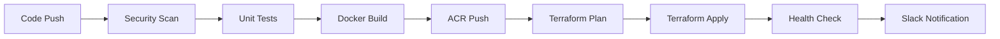
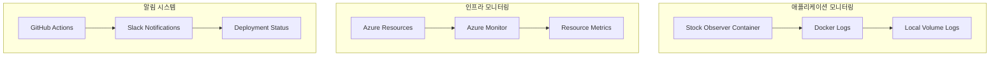
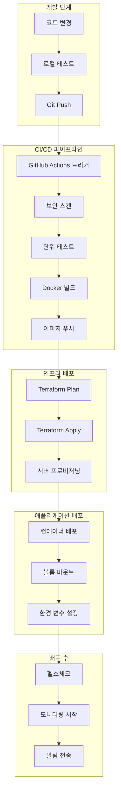

# Stock Observer Architecture v0.3

**Based on:** PRD v0.1 (Finalized)  
**Project:** Stock Observer (Multi-Provider Snapshot Logger)  
**Created:** 2026-01-14

---

## 1. 아키텍처 개요 (Architecture Overview)

### 1.1 설계 원칙

**최우선 가치:**
- **안정성 우선 (가중 6):** 장애 발생 시 증거 기록 필수
- **최대 로그 수집 (가중 4):** 가능한 범위 내 최대 기록, 필요시 최소 완화

**핵심 원칙:**
- 스냅샷 로깅에 집중 (매매/판단 로직 제외)
- 재현 가능한 원천 로그 보존
- 분리된 정책 계층 (Policy Layer)
- 조용한 실패 금지 (No Silent Failure)
- **프로바이더 독립성:** 다중 프로바이더 지원을 통한 확장성

### 1.2 시스템 구성도

```
┌─────────────────────────────────────────────────────────────────┐
│                 Provider Ingestion Layer                        │
│  ┌──────────┐  ┌──────────┐  ┌──────────┐  ┌──────────┐      │
│  │   KIS    │  │   Kiwoom │  │  Upbit   │  │ Overseas │      │
│  │   API    │  │   API    │  │  Crypto  │  │  Stocks  │      │
│  └─────┬────┘  └─────┬────┘  └─────┬────┘  └─────┬────┘      │
│        │              │              │              │          │
│        └──────────────┼──────────────┼──────────────┘          │
│                       │              │                         │
│              REST      │     WebSocket│                         │
└───────────────────────┼──────────────┼─────────────────────────┘
                        │              │
                        ▼              ▼
┌────────────────────────┐   ┌──────────────────────────┐
│   Track A (REST)       │   │   Track B (WebSocket)    │
│   Swing/Portfolio      │   │   Scalp High-Frequency   │
│   10분 주기            │   │   2Hz (완화시 1Hz)       │
│   09:00-15:30          │   │   09:30-15:00            │
└────────────┬───────────┘   └──────────┬───────────────┘
             │                          │
             └──────────┬───────────────┘
                        ▼
            ┌───────────────────────┐
            │  Universe Manager     │
            │  (전일 4,000원 이상)  │
            └───────────┬───────────┘
                        ▼
            ┌───────────────────────┐
            │   Observer Core       │
            │   - Validation        │
            │   - Guard             │
            │   - Enrichment        │
            └───────────┬───────────┘
                        ▼
            ┌───────────────────────┐
            │   Routing Engine      │
            │   (Track 분기)        │
            └─────┬─────────────┬───┘
                  │             │
        ┌─────────▼──┐    ┌────▼──────────┐
        │ Swing Path │    │  Scalp Path   │
        │            │    │  (41 Slots)   │
        └─────┬──────┘    └────┬──────────┘
              │                │
              │                ├──► Slot Manager
              │                └──► Overflow Ledger
              │
              └────────────┬───────────────┘
                           ▼
              ┌────────────────────────┐
              │  Log Partitioning      │
              │  - swing/              │
              │  - scalp/              │
              │  - system/             │
              └────────────┬───────────┘
                           ▼
              ┌────────────────────────┐
              │  Storage Layer         │
              │  - Raw Logs (3-10일)  │
              │  - DB (30일)          │
              └────────────┬───────────┘
                           ▼
              ┌────────────────────────┐
              │  Backup System         │
              │  (21:00 PC Pull)       │
              └────────────────────────┘
```

---

## 2. 핵심 컴포넌트 (Core Components)

### 2.1 Provider Ingestion Layer

**책임:**
- 다중 프로바이더 API 통합
- 프로바이더별 API 특성 추상화
- 인터페이스 표준화
- 연결 상태 관리

> **초기 Phase 1 구현 및 검증 기준 Provider:** 
> 한국투자증권(KIS) OpenAPI를 **초기 Normalized 모델 검증을 위한 참조 Provider**로 사용합니다.

**지원 프로바이더:**
- **KIS (한국투자증권):** 국내 주식 REST + WebSocket *(기준 API)*
- **Kiwoom (키움증권):** 국내 주식 COM/OCX + WebSocket
- **Upbit (업비트):** 암호화폐 REST + WebSocket
- **Overseas (해외주식):** Interactive Provider, Alpaca 등

**프로바이더 호환성 참고:**
> - 다른 프로바이더(예: Upbit, Kiwoom)의 경우 해당 프로바이더의 공식 API 필드에 맞춰 정렬해야 함
> - KIS 기준과 다른 필드는 `TODO` 또는 `PROVIDER_SPECIFIC`으로 마킹할 것
> - 프로바이더별 필드 매핑 테이블은 별도 유지 관리
>
> **예시 (Upbit 필드 매핑):**
> ```
> KIS.last_price    → Upbit.trade_price      (OK)
> KIS.bid_price     → Upbit.orderbook.bid[0] (TODO: 구조 변환 필요)
> KIS.symbol        → Upbit.market           (PROVIDER_SPECIFIC: 형식 다름 KRW-BTC)
> ```

**컴포넌트:**
```python
class ProviderEngine:
    def __init__(self, providers: Dict[str, ProviderAdapter])
    def get_rest_client(self, provider: str) -> ProviderRestClient
    def get_ws_client(self, provider: str) -> ProviderWSClient
    def get_supported_markets(self) -> Dict[str, MarketInfo]
    def normalize_symbol(self, symbol: str, provider: str) -> str
    def normalize_data(self, data: Dict, provider: str) -> NormalizedData
```

---

### 2.2 Universe Manager

**책임:**
- 다중 프로바이더 Universe 통합 관리
- 전일 종가 4,000원 이상 종목 선정 (주식)
- 암호화폐/해외주식별 기준 적용
- 일자별 Universe 스냅샷 파일 생성/관리
- 당일 Universe 고정 (재현성 보장)

**인터페이스:**
```python
class UniverseManager:
    def __init__(self, provider_engine: ProviderEngine)
    def load_universe(self, date: str, market: Market) -> List[Symbol]
    def create_daily_snapshot(self, date: str) -> Dict[Market, Path]
    def get_current_universe(self, market: Market) -> List[Symbol]
    def get_all_universes(self) -> Dict[Market, List[Symbol]]
```

---

### 2.3 Track A - Swing/Portfolio (REST)

**수집 정책:**
- 시간: 09:00 ~ 15:30 (주식), 24시간 (암호화폐)
- 주기: 10분 (완화 가능)
- 대상: 각 마켓별 Universe 전체
- 필드: 최소 필수 필드만

**컴포넌트:**
```python
class TrackACollector:
    def __init__(self, provider_engine: ProviderEngine, universe_manager: UniverseManager)
    def collect_snapshot(self, market: Market) -> List[SwingSnapshot]
    def schedule_collection(self, market: Market, interval: timedelta = timedelta(minutes=10))
    def get_active_markets(self) -> List[Market]
```

---

### 2.4 Track B - Scalp (WebSocket)

**수집 정책:**
- 시간: 09:30 ~ 15:00 (주식), 24시간 (암호화폐)
- 주기: 0.5초 (2Hz), 완화시 1초 (1Hz)
- 동시 보장: 41 종목 (마켓별 분리 가능)
- Overflow 처리: Ledger 기록

**컴포넌트:**
```python
class TrackBCollector:
    def __init__(self, provider_engine: ProviderEngine, slot_manager: SlotManager)
    def stream_ticks(self, market: Market) -> Iterator[ScalpSnapshot]
    def handle_overflow(self, market: Market, candidates: List[Symbol])
    def get_active_markets(self) -> List[Market]
```

---

### 2.5 Scalp Trigger Engine

**트리거 타입 (우선순위):**
1. 거래량 급증 (Volume Surge)
2. 체결 속도 증가 (Trade Velocity)
3. 변동성 급증 (Volatility Spike)
4. 수동 트리거 (Manual Override)

**추가 모니터링:**
- 급등락 (Price Spike) - 기본 유지

**컴포넌트:**
```python
class TriggerEngine:
    def evaluate_triggers(self, snapshot: Snapshot) -> List[Trigger]
    def calculate_priority(self, trigger: Trigger) -> float
    def select_top_candidates(self, triggers: List[Trigger], limit: int = 41) -> List[Symbol]
```

---

### 2.6 Observer Core (Phase 1: 아카이브 생성)

**책임:**
- Snapshot 수신 및 기본 검증
- 기본 Guard 체크
- PatternRecord 생성 (최소화)
- 아카이브용 EventBus 전달

**파이프라인 (Phase 1 최소화):**
```python
class Observer:
    def observe(self, snapshot: ObservationSnapshot):
        # Phase 1: Validation (기본)
        if not self.validator.validate(snapshot):
            self.log_validation_failure(snapshot)
            return
        
        # Phase 2: Guard (기본)
        if not self.guard.check(snapshot):
            self.log_guard_rejection(snapshot)
            return
        
        # Phase 3: Record Creation (기본)
        record = self.create_pattern_record(snapshot)
        
        # Phase 4: Enrichment (최소화)
        enriched = self.enricher.enrich_minimal(record)
        
        # Phase 5: Dispatch (아카이브용)
        self.event_bus.dispatch_to_archive(enriched)
```

**Phase 1 최소화 원칙:**
- 판단/실행 없음 (Observer_Scalp_Extension.md 준수)
- 기본 메타데이터만 추가
- 전략별 가공은 Phase 2 ETL로 이관
- 데이터 일관성 보장 (기존 호환성)

**41 슬롯 관리 (마켓별):**
```python
class SlotManager:
    MAX_SLOTS = 41  # 전체 또는 마켓별
    
    def __init__(self, provider_engine: ProviderEngine)
    def allocate_slot(self, market: Market, symbol: Symbol, trigger: TriggerType) -> Optional[Slot]
    def release_slot(self, market: Market, symbol: Symbol)
    def get_active_slots(self, market: Market) -> List[Slot]
    def record_overflow(self, market: Market, candidates: List[Candidate])
    def get_slot_utilization(self) -> Dict[Market, float]
```

---

### 2.7 Log Partitioning System

**디렉토리 구조:**
```
data/
  ├── swing/
  │   ├── kis/kr_stocks/YYYYMMDD/HH_00.jsonl
  │   ├── kiwoom/kr_stocks/YYYYMMDD/HH_00.jsonl
  │   ├── upbit/crypto/YYYYMMDD/HH_00.jsonl
  │   └── interactive_provider/us_stocks/YYYYMMDD/HH_00.jsonl
  ├── scalp/
  │   ├── kis/kr_stocks/YYYYMMDD/HH_MM_SS.jsonl
  │   ├── kiwoom/kr_stocks/YYYYMMDD/HH_MM_SS.jsonl
  │   ├── upbit/crypto/YYYYMMDD/HH_MM_SS.jsonl
  │   └── interactive_provider/us_stocks/YYYYMMDD/HH_MM_SS.jsonl
  └── system/
      ├── events/kis/YYYYMMDD.jsonl
      ├── events/kiwoom/YYYYMMDD.jsonl
      ├── events/upbit/YYYYMMDD.jsonl
      ├── events/interactive_provider/YYYYMMDD.jsonl
      └── overflow/
          ├── kis/YYYYMMDD_overflow.jsonl
          ├── kiwoom/YYYYMMDD_overflow.jsonl
          ├── upbit/YYYYMMDD_overflow.jsonl
          └── interactive_provider/YYYYMMDD_overflow.jsonl
```

**Rotation Manager:**
```python
class LogRotationManager:
    def rotate_swing_log(self, hour: int)
    def rotate_scalp_log(self, timestamp: datetime, risk_level: int)
    def rotate_system_log(self, date: str)
    def verify_integrity(self, log_file: Path) -> bool
```

---

### 2.8 Retention & Lifecycle Manager

**Raw 로그 정책:**
- 기본 보관: 3일
- 이상일 연장: 7일
- 백업 미완료: 삭제 금지
- 최대 캡: 10일

**DB 정책:**
- 서버 보관: 30일
- 백업 후 정리: backup-first

**컴포넌트:**
```python
class RetentionManager:
    def evaluate_retention(self, date: str) -> RetentionPolicy
    def extend_for_anomaly(self, date: str, reason: str)
    def cleanup_expired(self, backup_verified: bool)
    def get_retention_status(self) -> Dict[str, RetentionInfo]
```

**이상일 판정 조건:**
- WS 재연결 ≥ 20회/일
- WS 끊김 누적 ≥ 10분/일
- 로그 공백 60초 이상 2회 이상/일
- Scalp 기록률 < 97% (5분 이상)
- CPU ≥ 85% (10분 이상)
- 디스크 사용률 > 80%
- ETL 실패
- 백업 실패

---

### 2.9 Backup System

**백업 방식:**
- 실행 시간: 매일 21:00
- 방향: PC → Server (Pull)
- Gap-marker: 갭 증거 기록 (복원 없음)

> **Gap-marker 정책:** "Record gap evidence, don't restore"
> - 갭 발생 시 복원을 시도하지 않고 증거만 기록
> - 갭 정보는 `system/events/` 디렉토리에 `gap_marker` 이벤트로 저장
> - 분석 시 갭 구간을 명확히 식별하여 데이터 품질 평가에 활용

**컴포넌트:**
```python
class BackupManager:
    def create_daily_package(self, date: str) -> BackupPackage
    def generate_manifest(self, files: List[Path]) -> Manifest
    def calculate_checksums(self, files: List[Path]) -> Dict[str, str]
    def mark_success(self, package: BackupPackage)
```

---

### 2.10 Mitigation System (완화 정책)

**완화 우선순위:**
> **Symbol Coverage (41 slots)** > **Hz (Frequency)**
>
> 슬롯 커버리지를 먼저 보장하고, 부하 시 주파수를 낮춘다.

**완화 레벨 정의:**

| 레벨 | 주파수 | 상태 | 설명 |
|------|--------|------|------|
| Level 0 | 2Hz | 정상 | 기본 운영 모드 |
| Level 1 | 1Hz | 경미한 부하 | 리소스 사용량 증가 시 |
| Level 2 | 0.5Hz | 심각한 부하 | 시스템 안정성 우선 모드 |

**발동 조건 (5분 지속):**

| 조건 | Level 1 발동 | Level 2 발동 |
|------|-------------|-------------|
| CPU 사용률 | ≥ 80% | ≥ 90% |
| 메모리 사용률 | ≥ 85% | ≥ 95% |
| 디스크 쓰기 지연 | ≥ 500ms | ≥ 1000ms |
| 이벤트 큐 지연 | ≥ 2초 | ≥ 5초 |

**컴포넌트:**
```python
class MitigationController:
    PRIORITY = ["symbol_coverage", "frequency"]  # Coverage > Hz

    def monitor_resources(self) -> ResourceMetrics
    def evaluate_mitigation(self, metrics: ResourceMetrics) -> MitigationLevel
    def apply_mitigation(self, level: MitigationLevel)
    def log_mitigation_event(self, event: MitigationEvent)
    def get_current_hz(self, level: MitigationLevel) -> float:
        return {0: 2.0, 1: 1.0, 2: 0.5}[level]
```

---

### 2.11 WebSocket Reconnection Manager

**Backoff 정책:**
```
1s → 2s → 5s → 10s → 20s → 30s → 60s (반복)
```

**컴포넌트:**
```python
class ReconnectionManager:
    def handle_disconnect(self, reason: str)
    def calculate_backoff(self, attempt: int) -> float
    def attempt_reconnect(self) -> bool
    def log_reconnection_event(self, event: ReconnectionEvent)
```

**연속 실패 처리 (5분):**
- Scalp 기록 일시 중지
- System 로그에 강력 기록
- 이상일 마킹

---

### 2.12 Central Backup Coordinator

**책임:**
- 다중 서버 백업 조정
- Manifest 집계 및 통합
- 크로스 서버 모니터링
- 백업 스케줄 관리

**컴포넌트:**
```python
class CentralBackupCoordinator:
    def __init__(self, server_configs: Dict[str, ServerConfig])
    def schedule_backup_all_servers(self) -> BackupSchedule
    def aggregate_manifests(self, date: str) -> AggregatedManifest
    def monitor_server_health(self) -> Dict[str, ServerHealth]
    def coordinate_backup_pull(self) -> BackupResult
    def handle_backup_failures(self, failed_servers: List[str])
```

---

### 2.13 ETL Pipeline (Phase 2: DB 변환)

**Phase 1 현재 상태:**
- Raw 로그 → 아카이브 저장까지만 구현
- ETL은 Phase 2로 이관

**Phase 2 예상 기능:**
- 아카이브 → 자동매매 DB 변환
- 전략별 데이터 가공 (스윙/스캘프/포트폴리오)
- 일관성 보장 및 결측치 처리

**컴포넌트 (Phase 2 구현 예정):**
```python
class TradingETLPipeline:
    def extract_from_archive(self, date: str) -> List[EnrichedRecord]
    def transform_for_trading(self, records: List[EnrichedRecord]) -> List[TradingRecord]
    def load_to_trading_db(self, trading_records: List[TradingRecord])
    def verify_etl_success(self, date: str) -> bool
```

---

### 2.14 데이터 스키마 정의

> **스키마 연결성:** 모든 스키마는 `session_id`와 `symbol` 필드를 통해 상호 연결됩니다.

#### 2.14.1 Overflow Ledger 스키마

**파일 경로:** `system/overflow_YYYYMMDD.jsonl`

**스키마 예시:**
```json
{
  "timestamp": "2026-01-14T09:31:05.123Z",
  "provider": "kis",
  "symbol": "005930",
  "candidate_score": 0.87,
  "cutoff_rank": 41,
  "mitigation_level": 0,
  "decision_reason": "slot_full",
  "session_id": "sess_20260114_093000"
}
```

**필드 정의:**

| 필드 | 타입 | 필수 | 설명 |
|------|------|------|------|
| timestamp | ISO8601 | O | 이벤트 발생 시각 |
| provider | string | O | 프로바이더 식별자 (kis, upbit 등) |
| symbol | string | O | 종목 코드 |
| candidate_score | float | O | 후보 점수 (0.0~1.0) |
| cutoff_rank | int | O | 컷오프 순위 (41 고정) |
| mitigation_level | int | O | 현재 완화 레벨 (0/1/2) |
| decision_reason | string | O | 탈락 사유 (slot_full, low_score, manual_exclude 등) |
| session_id | string | O | 세션 식별자 |

---

#### 2.14.2 System Events 스키마 (Gap & Reconnect)

**파일 경로:** `system/events/{provider}/YYYYMMDD.jsonl`

##### gap_marker 이벤트

갭 발생 시 증거를 기록합니다. 복원을 시도하지 않습니다.

```json
{
  "event_type": "gap_marker",
  "gap_start_ts": "2026-01-14T10:15:00.000Z",
  "gap_end_ts": "2026-01-14T10:15:45.000Z",
  "gap_seconds": 45,
  "scope": "scalp",
  "reason": "ws_disconnect",
  "session_id": "sess_20260114_093000"
}
```

| 필드 | 타입 | 필수 | 설명 |
|------|------|------|------|
| event_type | string | O | 이벤트 유형 ("gap_marker" 고정) |
| gap_start_ts | ISO8601 | O | 갭 시작 시각 |
| gap_end_ts | ISO8601 | O | 갭 종료 시각 |
| gap_seconds | int | O | 갭 지속 시간 (초) |
| scope | string | O | 영향 범위 (scalp, swing, all) |
| reason | string | O | 갭 발생 사유 (ws_disconnect, api_error, rate_limit 등) |
| session_id | string | O | 세션 식별자 |

##### reconnection_event 이벤트

WebSocket 재연결 시도 및 결과를 기록합니다.

```json
{
  "event_type": "reconnection_event",
  "timestamp": "2026-01-14T10:15:45.000Z",
  "attempt_no": 3,
  "backoff_seconds": 5,
  "result": "SUCCESS",
  "recovered_slot_list": ["005930", "000660", "035720"],
  "mitigation_level_after": 1,
  "session_id": "sess_20260114_093000"
}
```

| 필드 | 타입 | 필수 | 설명 |
|------|------|------|------|
| event_type | string | O | 이벤트 유형 ("reconnection_event" 고정) |
| timestamp | ISO8601 | O | 재연결 시각 |
| attempt_no | int | O | 재연결 시도 횟수 |
| backoff_seconds | int | O | 백오프 대기 시간 (초) |
| result | string | O | 결과 (SUCCESS, FAIL) |
| recovered_slot_list | array | - | 복구된 슬롯 종목 코드 리스트 |
| mitigation_level_after | int | O | 재연결 후 완화 레벨 |
| session_id | string | O | 세션 식별자 |

---

#### 2.14.3 공통 메타 필드 (Common Meta)

모든 DB 테이블에 공통으로 적용되는 메타 필드입니다.

```json
{
  "schema_version": "1.0",
  "event_time": "2026-01-14T09:31:05.123Z",
  "receive_time": "2026-01-14T09:31:05.128Z",
  "session_id": "sess_20260114_093000",
  "mitigation_level": 0,
  "quality_flag": "normal",
  "raw_ref": "scalp/kis/kr_stocks/20260114/09_31_05.jsonl:1523"
}
```

| 필드 | 타입 | 필수 | 설명 |
|------|------|------|------|
| schema_version | string | O | 스키마 버전 |
| event_time | ISO8601 | O | 원본 이벤트 발생 시각 |
| receive_time | ISO8601 | O | 시스템 수신 시각 |
| session_id | string | O | 세션 식별자 |
| mitigation_level | int | O | 수집 당시 완화 레벨 |
| quality_flag | string | O | 데이터 품질 플래그 (normal, degraded, gap) |
| raw_ref | string | - | 원본 로그 파일 참조 경로 |

---

#### 2.14.4 Scalp 테이블 스키마

##### scalp_ticks (틱 데이터)

```sql
CREATE TABLE scalp_ticks (
    id              BIGSERIAL PRIMARY KEY,
    symbol          VARCHAR(20) NOT NULL,
    event_time      TIMESTAMPTZ NOT NULL,
    bid_price       NUMERIC(15,4),
    ask_price       NUMERIC(15,4),
    bid_size        BIGINT,
    ask_size        BIGINT,
    last_price      NUMERIC(15,4),
    volume          BIGINT,
    session_id      VARCHAR(50) NOT NULL,
    -- Common Meta
    schema_version  VARCHAR(10) DEFAULT '1.0',
    receive_time    TIMESTAMPTZ,
    mitigation_level INT DEFAULT 0,
    quality_flag    VARCHAR(20) DEFAULT 'normal'
);

CREATE INDEX idx_scalp_ticks_symbol_time ON scalp_ticks(symbol, event_time);
CREATE INDEX idx_scalp_ticks_session ON scalp_ticks(session_id);
```

| 컬럼 | 타입 | 설명 |
|------|------|------|
| id | BIGSERIAL | PK |
| symbol | VARCHAR(20) | 종목 코드 |
| event_time | TIMESTAMPTZ | 이벤트 시각 |
| bid_price | NUMERIC(15,4) | 매수 호가 |
| ask_price | NUMERIC(15,4) | 매도 호가 |
| bid_size | BIGINT | 매수 잔량 |
| ask_size | BIGINT | 매도 잔량 |
| last_price | NUMERIC(15,4) | 체결가 |
| volume | BIGINT | 체결량 |
| session_id | VARCHAR(50) | 세션 ID |

##### scalp_1m_bars (1분봉)

```sql
CREATE TABLE scalp_1m_bars (
    symbol          VARCHAR(20) NOT NULL,
    bar_time        TIMESTAMPTZ NOT NULL,
    open            NUMERIC(15,4),
    high            NUMERIC(15,4),
    low             NUMERIC(15,4),
    close           NUMERIC(15,4),
    volume          BIGINT,
    coverage_ratio  FLOAT,
    session_id      VARCHAR(50) NOT NULL,
    -- Common Meta
    schema_version  VARCHAR(10) DEFAULT '1.0',
    mitigation_level INT DEFAULT 0,
    quality_flag    VARCHAR(20) DEFAULT 'normal',
    PRIMARY KEY (symbol, bar_time)
);

CREATE INDEX idx_scalp_1m_bars_session ON scalp_1m_bars(session_id);
```

| 컬럼 | 타입 | 설명 |
|------|------|------|
| symbol | VARCHAR(20) | 종목 코드 |
| bar_time | TIMESTAMPTZ | 봉 시작 시각 |
| open | NUMERIC(15,4) | 시가 |
| high | NUMERIC(15,4) | 고가 |
| low | NUMERIC(15,4) | 저가 |
| close | NUMERIC(15,4) | 종가 |
| volume | BIGINT | 거래량 |
| coverage_ratio | FLOAT | 데이터 커버리지 비율 (0.0~1.0) |
| session_id | VARCHAR(50) | 세션 ID |

##### scalp_gaps (갭 기록)

```sql
CREATE TABLE scalp_gaps (
    id              SERIAL PRIMARY KEY,
    gap_start_ts    TIMESTAMPTZ NOT NULL,
    gap_end_ts      TIMESTAMPTZ NOT NULL,
    gap_seconds     INT NOT NULL,
    scope           VARCHAR(20),
    reason          VARCHAR(100),
    session_id      VARCHAR(50) NOT NULL
);

CREATE INDEX idx_scalp_gaps_session ON scalp_gaps(session_id);
CREATE INDEX idx_scalp_gaps_time ON scalp_gaps(gap_start_ts);
```

| 컬럼 | 타입 | 설명 |
|------|------|------|
| id | SERIAL | PK |
| gap_start_ts | TIMESTAMPTZ | 갭 시작 시각 |
| gap_end_ts | TIMESTAMPTZ | 갭 종료 시각 |
| gap_seconds | INT | 갭 지속 시간 (초) |
| scope | VARCHAR(20) | 영향 범위 |
| reason | VARCHAR(100) | 갭 발생 사유 |
| session_id | VARCHAR(50) | 세션 ID |

---

#### 2.14.5 Swing 테이블 스키마

##### swing_bars_10m (10분봉)

```sql
CREATE TABLE swing_bars_10m (
    symbol          VARCHAR(20) NOT NULL,
    bar_time        TIMESTAMPTZ NOT NULL,
    open            NUMERIC(15,4),
    high            NUMERIC(15,4),
    low             NUMERIC(15,4),
    close           NUMERIC(15,4),
    volume          BIGINT,
    session_id      VARCHAR(50) NOT NULL,
    -- Common Meta
    schema_version  VARCHAR(10) DEFAULT '1.0',
    mitigation_level INT DEFAULT 0,
    quality_flag    VARCHAR(20) DEFAULT 'normal',
    PRIMARY KEY (symbol, bar_time)
);

CREATE INDEX idx_swing_10m_session ON swing_bars_10m(session_id);
```

| 컬럼 | 타입 | 설명 |
|------|------|------|
| symbol | VARCHAR(20) | 종목 코드 |
| bar_time | TIMESTAMPTZ | 봉 시작 시각 |
| open | NUMERIC(15,4) | 시가 |
| high | NUMERIC(15,4) | 고가 |
| low | NUMERIC(15,4) | 저가 |
| close | NUMERIC(15,4) | 종가 |
| volume | BIGINT | 거래량 |
| session_id | VARCHAR(50) | 세션 ID |

##### eod_prices (종가 데이터)

```sql
CREATE TABLE eod_prices (
    symbol          VARCHAR(20) NOT NULL,
    trade_date      DATE NOT NULL,
    open            NUMERIC(15,4),
    high            NUMERIC(15,4),
    low             NUMERIC(15,4),
    close           NUMERIC(15,4),
    volume          BIGINT,
    prev_close      NUMERIC(15,4),
    -- Common Meta
    schema_version  VARCHAR(10) DEFAULT '1.0',
    PRIMARY KEY (symbol, trade_date)
);

CREATE INDEX idx_eod_prices_date ON eod_prices(trade_date);
```

| 컬럼 | 타입 | 설명 |
|------|------|------|
| symbol | VARCHAR(20) | 종목 코드 |
| trade_date | DATE | 거래일 |
| open | NUMERIC(15,4) | 시가 |
| high | NUMERIC(15,4) | 고가 |
| low | NUMERIC(15,4) | 저가 |
| close | NUMERIC(15,4) | 종가 |
| volume | BIGINT | 거래량 |
| prev_close | NUMERIC(15,4) | 전일 종가 |

---

#### 2.14.6 Portfolio 테이블 스키마

##### portfolio_policy (포트폴리오 정책)

```sql
CREATE TABLE portfolio_policy (
    policy_id       VARCHAR(50) PRIMARY KEY,
    name            VARCHAR(100) NOT NULL,
    rebalance_freq  VARCHAR(20),
    max_position_pct FLOAT,
    created_at      TIMESTAMPTZ DEFAULT NOW()
);
```

| 컬럼 | 타입 | 설명 |
|------|------|------|
| policy_id | VARCHAR(50) | PK |
| name | VARCHAR(100) | 정책명 |
| rebalance_freq | VARCHAR(20) | 리밸런싱 주기 (daily, weekly, monthly) |
| max_position_pct | FLOAT | 최대 포지션 비율 |
| created_at | TIMESTAMPTZ | 생성 시각 |

##### target_weights (목표 비중)

```sql
CREATE TABLE target_weights (
    policy_id       VARCHAR(50) REFERENCES portfolio_policy(policy_id),
    symbol          VARCHAR(20) NOT NULL,
    target_weight   FLOAT NOT NULL,
    effective_date  DATE NOT NULL,
    PRIMARY KEY (policy_id, symbol, effective_date)
);
```

| 컬럼 | 타입 | 설명 |
|------|------|------|
| policy_id | VARCHAR(50) | FK → portfolio_policy |
| symbol | VARCHAR(20) | 종목 코드 |
| target_weight | FLOAT | 목표 비중 (0.0~1.0) |
| effective_date | DATE | 적용일 |

##### portfolio_snapshot (포트폴리오 스냅샷)

```sql
CREATE TABLE portfolio_snapshot (
    snapshot_id     BIGSERIAL PRIMARY KEY,
    policy_id       VARCHAR(50) REFERENCES portfolio_policy(policy_id),
    snapshot_time   TIMESTAMPTZ NOT NULL,
    total_value     NUMERIC(20,4),
    cash            NUMERIC(20,4),
    session_id      VARCHAR(50)
);

CREATE INDEX idx_portfolio_snapshot_policy ON portfolio_snapshot(policy_id);
CREATE INDEX idx_portfolio_snapshot_session ON portfolio_snapshot(session_id);
```

| 컬럼 | 타입 | 설명 |
|------|------|------|
| snapshot_id | BIGSERIAL | PK |
| policy_id | VARCHAR(50) | FK → portfolio_policy |
| snapshot_time | TIMESTAMPTZ | 스냅샷 시각 |
| total_value | NUMERIC(20,4) | 총 평가액 |
| cash | NUMERIC(20,4) | 현금 |
| session_id | VARCHAR(50) | 세션 ID |

##### portfolio_positions (포지션)

```sql
CREATE TABLE portfolio_positions (
    snapshot_id     BIGINT REFERENCES portfolio_snapshot(snapshot_id),
    symbol          VARCHAR(20) NOT NULL,
    quantity        BIGINT,
    avg_price       NUMERIC(15,4),
    market_value    NUMERIC(20,4),
    weight_pct      FLOAT,
    PRIMARY KEY (snapshot_id, symbol)
);
```

| 컬럼 | 타입 | 설명 |
|------|------|------|
| snapshot_id | BIGINT | FK → portfolio_snapshot |
| symbol | VARCHAR(20) | 종목 코드 |
| quantity | BIGINT | 보유 수량 |
| avg_price | NUMERIC(15,4) | 평균 단가 |
| market_value | NUMERIC(20,4) | 평가 금액 |
| weight_pct | FLOAT | 현재 비중 |

##### rebalance_plan (리밸런싱 계획)

```sql
CREATE TABLE rebalance_plan (
    plan_id         BIGSERIAL PRIMARY KEY,
    policy_id       VARCHAR(50) REFERENCES portfolio_policy(policy_id),
    created_at      TIMESTAMPTZ DEFAULT NOW(),
    status          VARCHAR(20) DEFAULT 'pending',
    session_id      VARCHAR(50)
);

CREATE INDEX idx_rebalance_plan_session ON rebalance_plan(session_id);
```

| 컬럼 | 타입 | 설명 |
|------|------|------|
| plan_id | BIGSERIAL | PK |
| policy_id | VARCHAR(50) | FK → portfolio_policy |
| created_at | TIMESTAMPTZ | 생성 시각 |
| status | VARCHAR(20) | 상태 (pending, executing, done, cancelled) |
| session_id | VARCHAR(50) | 세션 ID |

##### rebalance_orders (리밸런싱 주문)

```sql
CREATE TABLE rebalance_orders (
    order_id        BIGSERIAL PRIMARY KEY,
    plan_id         BIGINT REFERENCES rebalance_plan(plan_id),
    symbol          VARCHAR(20) NOT NULL,
    side            VARCHAR(10) NOT NULL,
    target_qty      BIGINT,
    order_type      VARCHAR(20)
);

CREATE INDEX idx_rebalance_orders_plan ON rebalance_orders(plan_id);
```

| 컬럼 | 타입 | 설명 |
|------|------|------|
| order_id | BIGSERIAL | PK |
| plan_id | BIGINT | FK → rebalance_plan |
| symbol | VARCHAR(20) | 종목 코드 |
| side | VARCHAR(10) | 매수/매도 (BUY, SELL) |
| target_qty | BIGINT | 목표 수량 |
| order_type | VARCHAR(20) | 주문 유형 (MARKET, LIMIT) |

##### rebalance_execution (체결 기록)

```sql
CREATE TABLE rebalance_execution (
    exec_id         BIGSERIAL PRIMARY KEY,
    order_id        BIGINT REFERENCES rebalance_orders(order_id),
    filled_qty      BIGINT,
    filled_price    NUMERIC(15,4),
    exec_time       TIMESTAMPTZ,
    status          VARCHAR(20)
);

CREATE INDEX idx_rebalance_execution_order ON rebalance_execution(order_id);
```

| 컬럼 | 타입 | 설명 |
|------|------|------|
| exec_id | BIGSERIAL | PK |
| order_id | BIGINT | FK → rebalance_orders |
| filled_qty | BIGINT | 체결 수량 |
| filled_price | NUMERIC(15,4) | 체결 단가 |
| exec_time | TIMESTAMPTZ | 체결 시각 |
| status | VARCHAR(20) | 상태 (PARTIAL, FILLED, REJECTED) |

---

## 3. 데이터 흐름 (Data Flow)

### 3.1 Track A 흐름

```
프로바이더 REST API
    ↓
Universe Manager (전체 종목)
    ↓
Track A Collector (10분 주기)
    ↓
Observer Core (Validation → Guard → Enrich)
    ↓
Log Partitioning (swing/YYYYMMDD/HH_00.jsonl)
    ↓
Storage (3-10일)
    ↓
Backup (21:00 Pull)
```

### 3.2 Track B 흐름

```
프로바이더 WebSocket API
    ↓
Candidate Monitor (전체 종목 모니터링)
    ↓
Trigger Engine (4가지 트리거 평가)
    ↓
Slot Manager (41개 선정)
    ├─► Selected → Track B Collector (2Hz)
    └─► Rejected → Overflow Ledger
         ↓
Observer Core (Validation → Guard → Enrich)
    ↓
Log Partitioning (scalp/YYYYMMDD/HH_MM_SS.jsonl)
    ↓
Storage (3-10일)
    ↓
Backup (21:00 Pull)
```

---

## 4. 모니터링 지표 (Monitoring Metrics)

### 4.1 System 로그 필수 항목

**WebSocket 상태:**
- 연결 상태
- 재연결 횟수
- 끊김 누적 시간

**수집 품질:**
- Track A/B 기록률
- 드롭률
- 로그 공백 발생

**시스템 리소스:**
- CPU 사용률
- 메모리 사용률
- 디스크 사용률
- 디스크 쓰기 지연

**이벤트 처리:**
- 이벤트 큐 지연
- 백프레셔 발생

**Scalp 운영:**
- 41 슬롯 점유율
- 슬롯 교체 횟수
- Overflow 발생 횟수

**백업/ETL:**
- 백업 성공 여부 (SUCCESS.marker)
- 로테이션 성공 여부

---

## 5. 보안 정책 (Security)

### 5.1 API 키/토큰 관리

**절대 금지:**
- 로그에 API 키/토큰 기록
- 평문 저장

**필수 조치:**
- 환경 변수 사용
- 키 분리 (백업 전용 계정)
- 위반 시 즉시 중단/폐기/로테이션

### 5.2 백업 접근 권한

- 백업 전용 계정
- 읽기 전용 경로
- 최소 권한 원칙

---

## 6. 배포 구조 (Deployment)

### 6.1 단일 서버 구성 (초기)

```
┌─────────────────────────────────────┐
│         Observer Server             │
│                                     │
│  ┌──────────────────────────────┐  │
│  │  Track A Collector           │  │
│  │  Track B Collector           │  │
│  │  Observer Core               │  │
│  │  Log Partitioning            │  │
│  │  Retention Manager           │  │
│  └──────────────────────────────┘  │
│                                     │
│  Storage: /data/observer/           │
│    ├── kis/                          │
│    ├── kiwoom/                       │
│    ├── upbit/                        │
│    └── interactive_provider/          │
└─────────────────────────────────────┘
         ↓ (21:00 Pull)
┌─────────────────────────────────────┐
│      Windows PC (Backup)            │
└─────────────────────────────────────┘
```

### 6.2 API별 서버 분리 구성 (권장)

```
┌─────────────────┐  ┌─────────────────┐  ┌─────────────────┐  ┌─────────────────┐
│   KIS Server    │  │  Kiwoom Server  │  │   Upbit Server  │  │  IB Server      │
│                 │  │                 │  │                 │  │                 │
│  - KIS Collector│  │ Kiwoom Collector│  │ Upbit Collector│  │ IB Collector    │
│  - KIS Observer │  │ Kiwoom Observer │  │ Upbit Observer │  │ IB Observer     │
│  - KIS ETL      │  │ Kiwoom ETL      │  │ Upbit ETL      │  │ IB ETL         │
│                 │  │                 │  │                 │  │                 │
│  Storage:       │  │ Storage:        │  │ Storage:        │  │ Storage:        │
│  /data/kis/     │  │ /data/kiwoom/   │  │ /data/upbit/   │  │ /data/ib/      │
└─────────┬───────┘  └─────────┬───────┘  └─────────┬───────┘  └─────────┬───────┘
          │                    │                    │                    │
          └────────────────────┼────────────────────┼────────────────────┘
                               │                    │
                               ▼                    ▼
                    ┌─────────────────────────────────────┐
                    │     Central Backup Coordinator     │
                    │                                     │
                    │  - Backup Schedule Management      │
                    │  - Manifest Aggregation             │
                    │  - Cross-Server Monitoring         │
                    └─────────────────┬───────────────────┘
                                  │ (21:00 Pull)
                                  ▼
                    ┌─────────────────────────────────────┐
                    │      Windows PC (Backup)            │
                    │                                     │
                    │  backup/                            │
                    │    ├── kis/                         │
                    │    ├── kiwoom/                      │
                    │    ├── upbit/                       │
                    │    └── interactive_provider/         │
                    └─────────────────────────────────────┘
```

---

## 7. 수용 기준 매핑 (Acceptance Criteria)

| AC | 요구사항 | 관련 컴포넌트 |
|----|---------|--------------|
| AC-01 | Universe 일자별 생성 | Universe Manager |
| AC-02 | Track A 10분 주기 | Track A Collector, Log Partitioning |
| AC-03 | Track B 2Hz/1Hz | Track B Collector, Mitigation Controller |
| AC-04 | Overflow Ledger | Slot Manager, Overflow Ledger |
| AC-05 | 21:00 백업 | Backup Manager |
| AC-06 | Gap-marker 기록 | Backup Manager, System Events |
| AC-07 | Raw 리텐션 | Retention Manager |
| AC-08 | 키/토큰 보안 | Security Layer |

---

## 8. 구현 우선순위 (Implementation Priority)

### Phase 1: KIS 아카이브 생성 (현재 목표)

#### Phase 1.1: KIS 기반 아키텍처 구현

**P0 (최우선):**
- KIS Provider Engine 기본 구현
- KIS Universe Manager (일자별 생성)
- KIS Track A Collector (10분 주기)
- KIS Track B Collector (2Hz 기본)
- Observer Core (최소화)
- Log Partitioning (KIS 전용)

**P1 (중요):**
- KIS Scalp Trigger Engine (기본 4가지)
- KIS Slot Manager (41 슬롯)
- KIS Overflow Ledger
- KIS Backup System (21:00 Pull)
- KIS WebSocket Reconnection Manager

**P2 (보조):**
- KIS Mitigation System (기본 완화)
- KIS Retention Manager (기본 정책)
- KIS 모니터링 기본 구성

#### Phase 1.2: KIS 서버 테스트 및 안정화
- KIS 단일 서버 구성 테스트
- 아카이브 생성 검증
- 백업 시스템 테스트
- 모니터링 기본 구성
- 안정성 검증 (최소 1주일 운영)

---

### Phase 2: 다중 프로바이더 확장 (후반 페이즈)

#### Phase 2.1: Kiwoom API 연결
**P0 (최우선):**
- Kiwoom Provider Engine 구현
- Kiwoom Universe Manager (국내 주식)
- Kiwoom Track A/B Collector
- Kiwoom Log Partitioning
- Kiwoom Backup 통합

**P1 (중요):**
- Kiwoom WebSocket 연동
- Kiwoom Scalp Trigger Engine
- Kiwoom 슬롯 관리
- Kiwoom Overflow Ledger

#### Phase 2.2: Upbit API 연결
**P0 (최우선):**
- Upbit Provider Engine 구현
- Upbit Universe Manager (암호화폐)
- Upbit Track A/B Collector
- Upbit Log Partitioning
- Upbit Backup 통합

**P1 (중요):**
- Upbit WebSocket 연동
- Upbit Scalp Trigger Engine
- Upbit 슬롯 관리
- Upbit Overflow Ledger

#### Phase 2.3: 해외주식 API 연결
**P0 (최우선):**
- Interactive Provider Provider Engine 구현
- IB Universe Manager (미국 주식)
- IB Track A/B Collector
- IB Log Partitioning
- IB Backup 통합

**P1 (중요):**
- IB WebSocket 연동
- IB Scalp Trigger Engine
- IB 슬롯 관리
- IB Overflow Ledger

---

### Phase 3: 다중 서버 통합

#### Phase 3.1: 단일 서버 다중 프로바이더 통합

**통합 프로바이더 엔진:**
```python
class UnifiedProviderIngestion:
    def __init__(self):
        self.providers = {
            "kis": KISProviderAdapter(),
            "kiwoom": KiwoomProviderAdapter(), 
            "upbit": UpbitProviderAdapter(),
            "interactive_provider": IBProviderAdapter()
        }
        self.health_monitor = ProviderHealthMonitor()
        
    def start_all_providers(self):
        for provider_name, provider in self.providers.items():
            provider.initialize()
            self.health_monitor.register_provider(provider_name, provider)
            
    def get_unified_universe(self, date: str) -> Dict[str, MarketUniverse]:
        # 모든 프로바이더 Universe 통합
        unified = {}
        for provider_name, provider in self.providers.items():
            universe = provider.get_universe(date)
            unified[provider_name] = universe
        return unified
```

**마켓별 데이터 통합:**
```python
class MarketDataAggregator:
    def __init__(self, provider_engine: UnifiedProviderIngestion):
        self.provider_engine = provider_engine
        self.market_unifiers = {
            "kr_stocks": KRStocksUnifier(),
            "crypto": CryptoUnifier(),
            "us_stocks": USStocksUnifier()
        }
    
    def collect_market_data(self, market: str) -> List[UnifiedSnapshot]:
        unifier = self.market_unifiers[market]
        provider_data = self.provider_engine.get_market_snapshots(market)
        return unifier.unify_snapshots(provider_data)
```

**통합 로그 관리:**
```python
class UnifiedLogManager:
    def __init__(self):
        self.partition_manager = UnifiedPartitionManager()
        
    def archive_snapshot(self, snapshot: UnifiedSnapshot):
        # 프로바이더별로 분리된 경로에 저장
        path = self.partition_manager.get_archive_path(snapshot)
        self.write_to_archive(snapshot, path)
```

---

#### Phase 3.2: 분산 서버 아키텍처

**서버별 역할 분담:**
```python
@dataclass
class ServerRole:
    server_id: str
    provider: str
    markets: List[str]
    responsibilities: List[str]  # ["collection", "processing", "backup"]

SERVER_ROLES = {
    "kis-server": ServerRole(
        server_id="kis-server",
        provider="kis", 
        markets=["kr_stocks"],
        responsibilities=["collection", "processing", "backup"]
    ),
    "crypto-server": ServerRole(
        server_id="crypto-server",
        provider="upbit",
        markets=["crypto"], 
        responsibilities=["collection", "processing", "backup"]
    ),
    "us-server": ServerRole(
        server_id="us-server",
        provider="interactive_provider",
        markets=["us_stocks"],
        responsibilities=["collection", "processing", "backup"]
    )
}
```

**서버 간 통신 프로토콜:**
```python
class InterServerCommunication:
    def __init__(self):
        self.message_bus = RedisMessageBus()
        self.health_checker = HealthChecker()
        
    def broadcast_heartbeat(self, server_id: str):
        self.message_bus.publish(f"heartbeat.{server_id}", {
            "timestamp": datetime.now().isoformat(),
            "server_id": server_id,
            "status": "healthy",
            "provider_load": self.get_provider_load()
        })
        
    def request_cross_market_data(self, market: str) -> List[CrossMarketData]:
        # 다른 서버에 크로스 마켓 데이터 요청
        return self.message_bus.request(f"cross_market.{market}")
```

**중앙 조정자:**
```python
class CentralCoordinator:
    def __init__(self):
        self.server_registry = ServerRegistry()
        self.load_balancer = LoadBalancer()
        self.backup_coordinator = BackupCoordinator()
        
    def coordinate_collection_schedule(self):
        # 서버별 수집 스케줄 조정
        for server in self.server_registry.get_active_servers():
            schedule = self.calculate_optimal_schedule(server)
            self.send_schedule_to_server(server.server_id, schedule)
            
    def handle_server_failure(self, failed_server: str):
        # 서버 장애 시 failover 처리
        backup_servers = self.load_balancer.find_backup_candidates(failed_server)
        self.redistribute_load(failed_server, backup_servers)
```

---

#### Phase 3.3: 데이터 동기화 및 일관성

**크로스 서버 데이터 동기화:**
```python
class CrossServerSyncManager:
    def __init__(self):
        self.sync_scheduler = SyncScheduler()
        self.conflict_resolver = ConflictResolver()
        
    def sync_universe_data(self, date: str):
        # 모든 서버의 Universe 데이터 동기화
        universes = {}
        for server in self.get_active_servers():
            universe = server.get_universe(date)
            universes[server.server_id] = universe
            
        # 중복 제거 및 통합
        unified_universe = self.conflict_resolver.merge_universes(universes)
        
        # 모든 서버에 통합 Universe 전파
        for server in self.get_active_servers():
            server.update_universe(date, unified_universe)
```

**시간 동기화:**
```python
class TimeSyncManager:
    def __init__(self):
        self.ntp_client = NTPClient()
        self.time_offset_tracker = TimeOffsetTracker()
        
    def sync_all_servers(self):
        master_time = self.ntp_client.get_master_time()
        for server in self.get_active_servers():
            offset = self.calculate_offset(server, master_time)
            server.sync_time(master_time, offset)
            
    def ensure_temporal_consistency(self, snapshots: List[Snapshot]):
        # 서버 간 시간 일관성 보장
        synced_snapshots = []
        for snapshot in snapshots:
            synced_time = self.normalize_timestamp(snapshot)
            synced_snapshots.append(snapshot.with_timestamp(synced_time))
        return synced_snapshots
```

---

#### Phase 3.4: 중앙 백업 시스템

**분산 백업 조정:**
```python
class DistributedBackupCoordinator:
    def __init__(self):
        self.backup_scheduler = BackupScheduler()
        self.integrity_checker = IntegrityChecker()
        
    def coordinate_daily_backup(self):
        # 모든 서버의 백업 조정
        backup_jobs = []
        for server in self.get_active_servers():
            job = self.create_backup_job(server)
            backup_jobs.append(job)
            
        # 병렬 백업 실행
        results = self.execute_parallel_backup(backup_jobs)
        
        # 백업 결과 집계 및 검증
        self.aggregate_backup_results(results)
        self.verify_backup_integrity(results)
```

**백업 데이터 통합:**
```python
class BackupAggregator:
    def __init__(self):
        self.manifest_builder = ManifestBuilder()
        self.checksum_calculator = ChecksumCalculator()
        
    def aggregate_daily_backup(self, date: str) -> AggregatedBackup:
        # 모든 서버 백업 데이터 집계
        server_backups = {}
        for server in self.get_active_servers():
            backup = server.get_daily_backup(date)
            server_backups[server.server_id] = backup
            
        # 통합 Manifest 생성
        manifest = self.manifest_builder.build_unified_manifest(
            date=date,
            server_backups=server_backups
        )
        
        # 통합 체크섬 계산
        checksums = self.checksum_calculator.calculate_aggregate_checksums(
            server_backups
        )
        
        return AggregatedBackup(
            date=date,
            manifest=manifest,
            checksums=checksums,
            server_backups=server_backups
        )
```

---

#### Phase 3.5: 모니터링 및 장애 처리

**분산 모니터링:**
```python
class DistributedMonitoringSystem:
    def __init__(self):
        self.metrics_collector = MetricsCollector()
        self.alert_manager = AlertManager()
        self.dashboard_aggregator = DashboardAggregator()
        
    def collect_all_server_metrics(self):
        # 모든 서버 메트릭 수집
        all_metrics = {}
        for server in self.get_active_servers():
            metrics = server.get_metrics()
            all_metrics[server.server_id] = metrics
            
        # 크로스 서버 메트릭 계산
        cross_server_metrics = self.calculate_cross_server_metrics(all_metrics)
        
        # 통합 대시보드 업데이트
        self.dashboard_aggregator.update_dashboard(all_metrics, cross_server_metrics)
```

**자동 장애 복구:**
```python
class AutoFailoverManager:
    def __init__(self):
        self.failure_detector = FailureDetector()
        self.recovery_orchestrator = RecoveryOrchestrator()
        
    def handle_server_failure(self, failed_server: str):
        # 장애 감지 및 분류
        failure_info = self.failure_detector.analyze_failure(failed_server)
        
        # 자동 복구 시도
        if failure_info.is_recoverable:
            self.recovery_orchestrator.attempt_recovery(failed_server, failure_info)
        else:
            # 수동 개입 필요
            self.alert_manager.send_critical_alert(failed_server, failure_info)
            
    def redistribute_load(self, failed_server: str):
        # 장애 서버의 부하 다른 서버로 분산
        affected_providers = self.get_affected_providers(failed_server)
        backup_servers = self.find_backup_servers(affected_providers)
        
        for provider, backup_server in zip(affected_providers, backup_servers):
            self.transfer_provider_responsibility(provider, failed_server, backup_server)
```

---

### Phase 4: 자동매매 DB 변환

#### Phase 4.1: ETL 파이프라인 구현
- TradingETLPipeline 구현
- 아카이브 → DB 변환
- 전략별 데이터 가공
- 일관성 보장 시스템

#### Phase 4.2: 전략별 DB 최적화
- Swing 데이터 가공 (10분/1시간 봉)
- Scalp 데이터 가공 (1분/5분 봉)
- Portfolio 데이터 가공 (일봉)
- 자동매매 DB 스키마 설계

---

### 현재 집중: Phase 1.1

#### KIS 기반 아카이브 생성 목표

**핵심 목표:**
```
KIS API → KIS Collector → Observer Core → KIS 아카이브 저장
```

**구현 범위:**
- **프로바이더:** KIS만 (Phase 1 범위 고정)
- **마켓:** 국내 주식만 (초기)
- **데이터:** Swing + Scalp + System
- **저장:** KIS 전용 아카이브 구조

**성공 기준:**
- KIS Track A: 10분 주기 안정적 수집
- KIS Track B: 2Hz 안정적 수집
- KIS 아카이브: 일자별 정상 생성
- KIS 백업: 21:00 자동 백업 성공

---

## 9. 배포 자동화 아키텍처 (Deployment Automation)

### 9.1 배포 철학

Stock Observer는 **"Package → Deploy → Automate → Monitor"** 4단계 철학을 따릅니다:

1. **Package**: Docker 컨테이너화로 애플리케이션 패키징
2. **Deploy**: Terraform으로 인프라 프로비저닝
3. **Automate**: GitHub Actions로 CI/CD 파이프라인 자동화
4. **Monitor**: 배포 후 지속적인 모니터링 및 운영

### 9.2 Docker 패키징 아키텍처

#### 컨테이너 설계
```dockerfile
FROM python:3.11-slim

WORKDIR /app

# 애플리케이션 복사
COPY observer.py /app/
COPY paths.py /app/
COPY src/ /app/src/

# 디렉토리 생성
RUN mkdir -p /app/data/observer \
    && mkdir -p /app/logs \
    && mkdir -p /app/config

# 환경 변수 설정
ENV OBSERVER_STANDALONE=1
ENV PYTHONPATH=/app/src:/app
ENV OBSERVER_DATA_DIR=/app/data/observer
ENV OBSERVER_LOG_DIR=/app/logs

# 보안 설정
RUN groupadd -r kis && useradd -r -g kis observer
RUN chown -R kis:kis /app
USER observer

# 헬스체크
HEALTHCHECK --interval=30s --timeout=10s --start-period=5s --retries=3 \
    CMD python -c "import sys; sys.exit(0)" || exit 1

EXPOSE 8000

CMD ["python", "observer.py"]
```

#### docker-compose.yml 구성
```yaml
version: '3.8'

services:
  stock-observer:
    build: .
    container_name: stock-observer
    restart: unless-stopped
    environment:
      - OBSERVER_STANDALONE=1
      - PYTHONPATH=/app/src:/app
      - OBSERVER_DATA_DIR=/app/data/observer
      - OBSERVER_LOG_DIR=/app/logs
    volumes:
      - ./data:/app/data/observer
      - ./logs:/app/logs
      - ./config:/app/config
    ports:
      - "8000:8000"
    networks:
      - observer-network

networks:
  observer-network:
    driver: bridge
```

### 9.3 Terraform 인프라 아키텍처

#### 핵심 구성요소
```hcl
# provider.tf - Azure 프로바이더 설정
provider "azurerm" {
  features {}
  subscription_id = var.subscription_id
  tenant_id       = var.tenant_id
}

# backend.tf - 원격 상태 관리
terraform {
  backend "azurerm" {
    resource_group_name  = "rg-stock-observer"
    storage_account_name = "stockobserverstorage"
    container_name       = "tfstate"
    key                  = "terraform.tfstate"
  }
}

# main.tf - 리소스 정의
module "resource_group" {
  source   = "./modules/resource_group"
  name     = var.resource_group_name
  location = var.location
}

module "container_registry" {
  source           = "./modules/container_registry"
  name             = "acrstockobserver"
  resource_group   = module.resource_group.name
  location         = var.location
}

module "container_instances" {
  source           = "./modules/container_instances"
  name             = "ci-stock-observer"
  resource_group   = module.resource_group.name
  location         = var.location
  registry_id      = module.container_registry.id
}
```

#### 모듈 구조
```
infra/
├── main.tf                    # 메인 리소스 정의
├── variables.tf               # 변수 정의
├── outputs.tf                 # 출력값 정의
├── provider.tf                # 프로바이더 설정
├── backend.tf                 # 원격 상태 저장
├── terraform.tfvars           # 환경 변수
├── modules/
│   ├── resource_group/        # 리소스 그룹 모듈
│   ├── container_registry/    # 컨테이너 레지스트리 모듈
│   ├── container_instances/   # 컨테이너 인스턴스 모듈
│   └── storage/               # 스토리지 모듈
└── scripts/
    └── deploy_to_infrastructure.sh
```

### 9.4 GitHub Actions CI/CD 아키텍처

#### 파이프라인 설계


#### 전체 CI/CD 파이프라인
```yaml
name: Stock Observer CI/CD Pipeline

on:
  push:
    branches: [main, develop]
  pull_request:
    branches: [main, develop]

jobs:
  security-scan:
    runs-on: ubuntu-latest
    steps:
      - name: Checkout code
        uses: actions/checkout@v4
      - name: Run Trivy vulnerability scanner
        uses: aquasecurity/trivy-action@master
        with:
          scan-type: 'fs'
          scan-ref: '.'
          format: 'sarif'
          output: 'trivy-results.sarif'
      - name: Upload Trivy scan results
        uses: github/codeql-action/upload-sarif@v2
        with:
          sarif_file: 'trivy-results.sarif'

  test:
    runs-on: ubuntu-latest
    steps:
      - name: Checkout code
        uses: actions/checkout@v4
      - name: Set up Python
        uses: actions/setup-python@v4
        with:
          python-version: '3.11'
      - name: Install dependencies
        run: |
          pip install -r requirements.txt
          pip install pytest
      - name: Run tests
        run: pytest tests/ -v --cov=src

  build:
    runs-on: ubuntu-latest
    needs: [security-scan, test]
    steps:
      - name: Checkout code
        uses: actions/checkout@v4
      - name: Set up Docker Buildx
        uses: docker/setup-buildx-action@v2
      - name: Login to Azure Container Registry
        uses: docker/login-action@v2
        with:
          registry: ${{ secrets.ACR_LOGIN_SERVER }}
          username: ${{ secrets.ACR_USERNAME }}
          password: ${{ secrets.ACR_PASSWORD }}
      - name: Build and push Docker image
        uses: docker/build-push-action@v4
        with:
          context: ./app/obs_deploy
          push: true
          tags: ${{ secrets.ACR_LOGIN_SERVER }}/stock-observer:${{ github.sha }}
          cache-from: type=gha
          cache-to: type=gha,mode=max

  terraform:
    runs-on: ubuntu-latest
    needs: build
    if: github.ref == 'refs/heads/main'
    env:
      ARM_SUBSCRIPTION_ID: ${{ secrets.ARM_SUBSCRIPTION_ID }}
      ARM_TENANT_ID: ${{ secrets.ARM_TENANT_ID }}
      ARM_CLIENT_ID: ${{ secrets.ARM_CLIENT_ID }}
      ARM_CLIENT_SECRET: ${{ secrets.ARM_CLIENT_SECRET }}
    steps:
      - name: Checkout code
        uses: actions/checkout@v4
      - name: Set up Terraform
        uses: hashicorp/setup-terraform@v3
      - name: Terraform Init
        run: terraform init
        working-directory: ./infra
      - name: Terraform Plan
        run: terraform plan -var-file="terraform.tfvars"
        working-directory: ./infra
      - name: Terraform Apply
        run: terraform apply -var-file="terraform.tfvars" -auto-approve
        working-directory: ./infra

  health-check:
    runs-on: ubuntu-latest
    needs: terraform
    steps:
      - name: Wait for deployment
        run: sleep 60
      - name: Health check
        run: |
          curl -f https://stock-observer.azurecontainer.io/health || exit 1

  notify:
    runs-on: ubuntu-latest
    needs: [health-check]
    if: always()
    steps:
      - name: Send Slack notification
        uses: slackapi/slack-github-action@v1
        with:
          payload: |
            {
              "text": "Stock Observer 배포 ${{ job.status }}!",
              "blocks": [
                {
                  "type": "section",
                  "text": {
                    "type": "mrkdwn",
                    "text": "*Stock Observer 배포 ${{ job.status }}*\n브랜치: ${{ github.ref }}\n커밋: ${{ github.sha }}\n작업자: ${{ github.actor }}"
                  }
                }
              ]
            }
        env:
          SLACK_WEBHOOK_URL: ${{ secrets.SLACK_WEBHOOK_URL }}
```

### 9.5 모니터링 및 운영 아키텍처

#### 모니터링 구성


#### 컨테이너 헬스체크
```dockerfile
HEALTHCHECK --interval=30s --timeout=10s --start-period=5s --retries=3 \
    CMD python -c "import sys; sys.exit(0)" || exit 1
```

#### 일일 운영 절차
```bash
# 1. 컨테이너 상태 확인
docker ps | grep stock-observer

# 2. 리소스 사용량 확인
docker stats stock-observer --no-stream

# 3. 로그 에러 확인
docker logs stock-observer --since 24h | grep -i error

# 4. 디스크 사용량 확인
df -h /app/data/observer

# 5. 네트워크 연결 확인
curl -f http://localhost:8000/health || echo "Health check failed"
```

### 9.6 보안 아키텍처

#### 컨테이너 보안
- **비-root 사용자**: observer 사용자로 실행 (kis 그룹 소속)
- **최소 권한**: 필요한 권한만 부여
- **헬스체크**: 컨테이너 상태 모니터링

#### 인프라 보안
- **Azure AD 통합**: Service Principal 인증
- **원격 상태 관리**: Azure Storage에 암호화 저장
- **비밀 정보 관리**: GitHub Secrets 사용

#### 코드 보안
- **Trivy 스캔**: 취약점 자동 스캔
- **SARIF 결과**: GitHub Security 탭에 통합

### 9.7 배포 프로세스

#### 전체 배포 흐름


#### 배포 체크리스트

**배포 전 확인사항**
- [ ] 코드 품질 검증 통과
- [ ] 보안 스캔 결과 확인
- [ ] 단위 테스트 통과
- [ ] Docker 이미지 빌드 성공
- [ ] Terraform plan 검토

**배포 중 확인사항**
- [ ] 인프라 리소스 생성 성공
- [ ] 컨테이너 배포 성공
- [ ] 볼륨 마운트 정상
- [ ] 환경 변수 설정 완료

**배포 후 확인사항**
- [ ] 헬스체크 통과
- [ ] 애플리케이션 로그 정상
- [ ] 데이터 볼륨 접근 가능
- [ ] 모니터링 지표 수집
- [ ] 알림 시스템 동작

---

## 10. 기술 스택 (Technology Stack)

**언어:** Python 3.11+

**핵심 라이브러리:**
- **Provider Ingestion:**
  - KIS API: requests, websocket-client
  - Kiwoom API: pywin32, comtypes
  - Upbit API: pyupbit, websocket-client
  - Overseas: ib_insync, alpaca-trade-api
- 데이터: pandas, polars
- 로깅: structlog
- 스케줄링: APScheduler
- DB: PostgreSQL (TimescaleDB)

**프로바이더별 특화 기술:**
```python
# 프로바이더별 설정
PROVIDER_CONFIGS = {
    "kis": {
        "rest": {"base_url": "https://openapi.koreainvestment.com", "auth": "oauth2"},
        "ws": {"url": "wss://openapi.koreainvestment.com:9443"},
        "markets": ["kr_stocks"]
    },
    "kiwoom": {
        "rest": {"com_object": "KHOpenAPI.KHOpenAPICtrl"},
        "ws": {"com_object": "KHOpenAPI.KHOpenAPICtrl"},
        "markets": ["kr_stocks"]
    },
    "upbit": {
        "rest": {"base_url": "https://api.upbit.com/v1"},
        "ws": {"url": "wss://api.upbit.com/websocket/v1"},
        "markets": ["crypto"]
    },
    "interactive_provider": {
        "rest": {"host": "127.0.0.1", "port": 7497},
        "ws": {"host": "127.0.0.1", "port": 7497},
        "markets": ["us_stocks", "global_stocks"]
    }
}
```

**마켓별 데이터 모델:**
```python
@dataclass
class MarketInfo:
    market: Market
    provider: str
    trading_hours: TradingHours
    symbol_format: str
    min_price_filter: float
    supported_data_types: List[DataType]

MARKET_INFO = {
    Market.KR_STOCKS: [
        MarketInfo(market=Market.KR_STOCKS, provider="kis", trading_hours=KR_STOCKS_HOURS, 
                  symbol_format="6자리숫자", min_price_filter=4000, 
                  supported_data_types=[DataType.OHLCV, DataType.TICK]),
        MarketInfo(market=Market.KR_STOCKS, provider="kiwoom", trading_hours=KR_STOCKS_HOURS,
                  symbol_format="6자리숫자", min_price_filter=4000,
                  supported_data_types=[DataType.OHLCV, DataType.TICK])
    ],
    Market.CRYPTO: [
        MarketInfo(market=Market.CRYPTO, provider="upbit", trading_hours=CRYPTO_24H,
                  symbol_format="KRW-BTC", min_price_filter=1000000000,
                  supported_data_types=[DataType.OHLCV, DataType.TICK, DataType.ORDERBOOK])
    ],
    Market.US_STOCKS: [
        MarketInfo(market=Market.US_STOCKS, provider="interactive_provider", trading_hours=US_STOCKS_HOURS,
                  symbol_format="AAPL", min_price_filter=1.0,
                  supported_data_types=[DataType.OHLCV, DataType.TICK])
    ]
}
```

**인프라:**
- Docker + Docker Compose
- systemd (자동 시작)
- Terraform (IaC)
- **서버별 분리:**
  - 각 프로바이더별 독립 서버
  - Central Backup Coordinator
  - 크로스 서버 모니터링

**모니터링:**
- Prometheus (메트릭)
- Grafana (시각화)
- Loki (로그 집계)
- **다중 서버 모니터링:**
  - 서버별 대시보드
  - 크로스 서버 health check
  - 중앙 집계 알림 시스템

---

## 10. 실행 모드 및 SSoT 선언

### 10.1 실행 모드
- **collect:** 아카이브 생성 모드 (현재 구현 완료)
- **etl:** DB 변환 모드 (Phase 04, 예약)

### 10.2 모드별 책임
| 모드 | 목적 | 출력 | 상세 |
|------|------|------|------|
| collect | 원본 로그 수집 | JSONL 아카이브 | [Phase 03 Archive Runner](phase_03_archive_runner.md) |
| etl | 분석용 DB 생성 | Trading DB | [Phase 04 Trading DB Runner](phase_04_trading_db_runner.md) (예약) |

### 10.3 SSoT (단일 진실 소스) 선언
- **Archive 관련:** [Phase 03 Archive Runner](phase_03_archive_runner.md)가 SSoT
- **Deployment 관련:** [Deployment Automation](deployment_automation.md)가 SSoT
- **ETL 관련:** [Phase 04 Trading DB Runner](phase_04_trading_db_runner.md)가 SSoT (예약)

---

## 11. 다음 단계

1. **용량 산정:** 일/주/월 로그량, 디스크/IOPS 요구사항
2. **상세 설계:** 각 컴포넌트 인터페이스 및 구현 명세
3. **테스트 전략:** 단위/통합/부하 테스트 계획
4. **운영 매뉴얼:** 장애 대응, 모니터링, 백업 복구 절차

---

**문서 버전:** v0.4
**최종 수정:** 2026-01-14
**작성자:** Cascade AI
**변경 이력:**
- v0.4: 실행 모드 및 SSoT 선언 추가, 앵커 문서 병합
- v0.3: 브로커 중심 용어를 프로바이더 중심 용어로 전면 리팩토링 (Broker → Provider)
- v0.2: Gap-marker 정책, Mitigation 레벨, 데이터 스키마 정의, 브로커 정렬 추가
