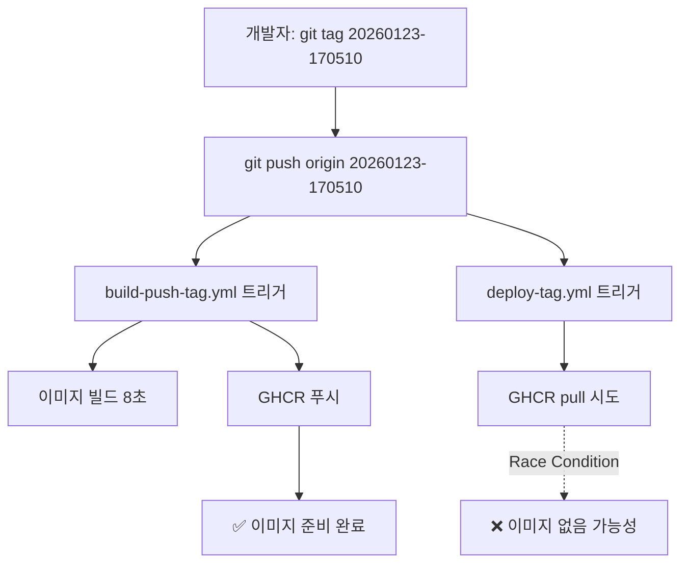
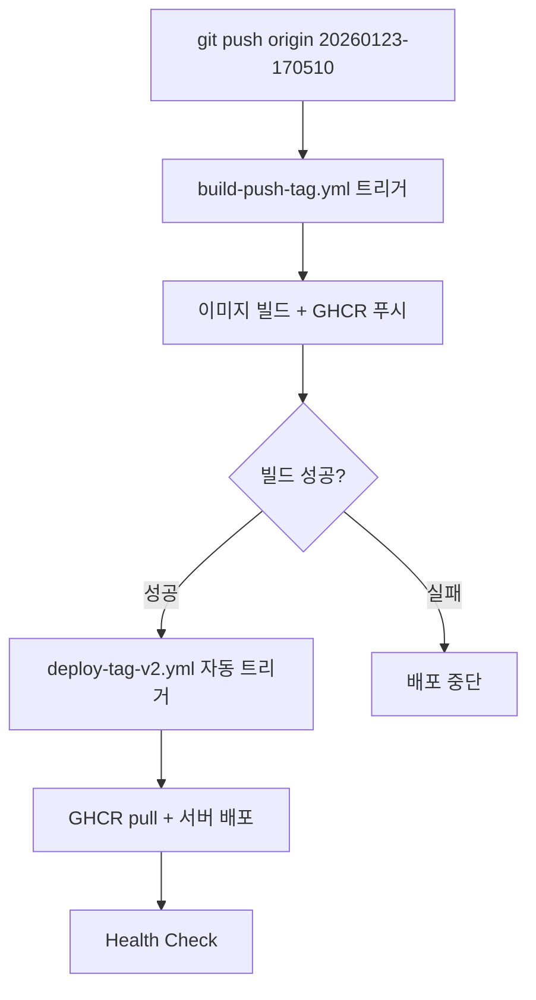

# GitHub Actions 워크플로우 태그 관리 방식 분석

**생성 일시**: 2026-01-23
**상태**: 권장 사항 제시

---

## 📋 요약

현재 2개의 워크플로우가 동일한 Git 태그 트리거를 공유하여 race condition 위험이 있습니다. **YML 기반 태그 관리 + 워크플로우 의존성 관리**를 권장합니다.

---

## 🔍 현재 구조 분석

### 워크플로우 목록

| 워크플로우 | 파일 | 트리거 | 역할 |
|----------|------|--------|------|
| Build & Push | `build-push-tag.yml` | 태그 푸시 `20*` | 이미지 빌드 + GHCR 푸시 |
| Deploy | `deploy-tag.yml` | 태그 푸시 `20*` | GHCR pull + 서버 배포 |

### 현재 흐름



### 문제점

1. **Race Condition**: deploy가 build보다 먼저 실행될 수 있음
2. **불확실성**: 성공/실패가 타이밍에 의존
3. **디버깅 어려움**: 간헐적 실패 원인 파악 곤란

---

## 🎯 태그 관리 방식 비교

### 옵션 1: YML 워크플로우 통제 ⭐ **권장**

#### 장점
- ✅ **단일 진실 공급원**: Git 태그 = Docker 태그
- ✅ **추적 가능성**: 모든 배포가 Git 히스토리에 기록
- ✅ **롤백 용이성**: 특정 Git 태그로 재배포
- ✅ **CI/CD 표준**: GitOps 모범 사례
- ✅ **자동화**: 태그 푸시만으로 전체 파이프라인 실행

#### 단점
- ❌ Git 태그 삭제/재생성이 번거로움
- ❌ 워크플로우 간 의존성 관리 필요

#### 구현 방식
```yaml
# build-push-tag.yml
on:
  push:
    tags: ['20*']

jobs:
  build-and-push:
    steps:
      - name: Set IMAGE_TAG
        run: echo "IMAGE_TAG=${{ github.ref_name }}" >> $GITHUB_OUTPUT
```

---

### 옵션 2: 스크립트 통제 ❌ **비권장**

#### 장점
- ✅ 동적 태그 생성 가능
- ✅ 로컬 테스트 용이

#### 단점
- ❌ **비표준**: CI/CD 모범 사례 위배
- ❌ **추적 어려움**: Git과 Docker 버전 분리
- ❌ **중복 로직**: 스크립트 + 워크플로우에 로직 중복
- ❌ **일관성 부족**: 환경별로 다른 태그 가능성

#### 구현 방식
```bash
#!/bin/bash
# scripts/build_and_tag.sh
TAG=$(date -u +"%Y%m%d-%H%M%S")
docker build -t ghcr.io/tawbury/observer:$TAG .
docker push ghcr.io/tawbury/observer:$TAG
```

---

## 🛠 권장 솔루션

### 해결 방안 A: `workflow_run` 의존성 관리 ⭐ **최우선 권장**

#### 변경 사항

**기존**:
```yaml
# deploy-tag.yml
on:
  push:
    tags: ['20*']  # ← build-push와 동시 실행 (race condition)
```

**개선**:
```yaml
# deploy-tag-v2.yml (새 파일)
on:
  workflow_run:
    workflows: ["Build & Push Observer Image (Tag)"]
    types: [completed]
  workflow_dispatch:
    inputs:
      image_tag:
        required: true
        type: string

jobs:
  deploy:
    # build-push가 성공했을 때만 실행
    if: ${{ github.event.workflow_run.conclusion == 'success' }}
```

#### 새로운 흐름



#### 장점
- ✅ **Race Condition 해결**: 빌드 완료 후에만 배포 시작
- ✅ **실패 전파 방지**: 빌드 실패 시 배포 자동 중단
- ✅ **명확한 의존성**: 워크플로우 순서 보장
- ✅ **수동 실행 지원**: 특정 태그로 재배포 가능

---

### 해결 방안 B: 단일 통합 워크플로우

#### 개념
build-push-tag.yml과 deploy-tag.yml을 하나로 통합

```yaml
# unified-deploy.yml
name: Build, Push & Deploy Observer

on:
  push:
    tags: ['20*']

jobs:
  build-and-push:
    runs-on: ubuntu-latest
    steps:
      - name: Build and push
        # ... 빌드 로직

  deploy:
    needs: build-and-push  # ← 명시적 의존성
    runs-on: ubuntu-latest
    steps:
      - name: Deploy to server
        # ... 배포 로직
```

#### 장점
- ✅ **단순성**: 하나의 파일로 전체 파이프라인 관리
- ✅ **명확한 순서**: `needs` 키워드로 의존성 명시

#### 단점
- ❌ **유연성 부족**: 빌드와 배포를 독립적으로 실행 불가
- ❌ **재배포 어려움**: 동일 태그 재배포 시 빌드도 다시 실행

---

## 📊 비교표

| 항목 | 방안 A (workflow_run) | 방안 B (통합) | 현재 (분리) |
|------|--------------------|-------------|------------|
| Race Condition | ✅ 해결 | ✅ 해결 | ❌ 존재 |
| 독립 실행 | ✅ 가능 | ❌ 불가 | ✅ 가능 |
| 재배포 용이성 | ✅ 우수 | ❌ 낮음 | ✅ 우수 |
| 유지보수성 | ⚠️ 보통 | ✅ 우수 | ❌ 낮음 |
| 빌드 실패 처리 | ✅ 자동 | ✅ 자동 | ❌ 수동 |
| 복잡도 | ⚠️ 중간 | ✅ 낮음 | ✅ 낮음 |

---

## 🎯 최종 권장 사항

### 1단계: deploy-tag.yml → deploy-tag-v2.yml 교체

```bash
# 1. 새 파일로 교체
cd .github/workflows
mv deploy-tag.yml deploy-tag.yml.old
mv deploy-tag-v2.yml deploy-tag.yml

# 2. 커밋 & 푸시
git add deploy-tag.yml deploy-tag.yml.old
git commit -m "fix: resolve race condition with workflow_run dependency"
git push origin observer
```

### 2단계: 테스트

```bash
# 1. 새 태그 생성
TAG=$(date -u +"%Y%m%d-%H%M%S")
git tag $TAG
git push origin $TAG

# 2. GitHub Actions 확인
# https://github.com/tawbury/observer/actions

# 3. 순서 검증
#    - build-push-tag.yml 먼저 실행 (8초)
#    - deploy-tag.yml은 build 완료 후 자동 실행
```

### 3단계: 구버전 삭제

```bash
# 테스트 성공 후
rm .github/workflows/deploy-tag.yml.old
git add .github/workflows/
git commit -m "chore: remove old deploy workflow"
```

---

## 📝 태그 생성 가이드

### 로컬에서 태그 생성 & 배포

```bash
# 1. 타임스탬프 태그 생성
TAG=$(date -u +"%Y%m%d-%H%M%S")
echo "Creating tag: $TAG"

# 2. Git 태그 생성 & 푸시
git tag $TAG
git push origin $TAG

# 3. GitHub Actions 자동 실행
# - build-push-tag.yml: 이미지 빌드 + GHCR 푸시
# - deploy-tag.yml: 빌드 완료 후 자동 배포

# 4. 배포 확인
# https://github.com/tawbury/observer/actions
```

### 수동 재배포 (동일 태그)

```bash
# GitHub Actions UI에서:
# 1. "Deploy to Azure VM" 워크플로우 선택
# 2. "Run workflow" 클릭
# 3. image_tag 입력: 20260123-170510
# 4. "Run workflow" 실행
```

---

## 🔒 보안 고려사항

### Git 태그 = Docker 태그 매핑의 이점

1. **감사 추적**: 누가 언제 어떤 코드를 배포했는지 Git 히스토리로 추적
2. **재현 가능성**: 특정 태그로 체크아웃하여 동일한 이미지 재빌드 가능
3. **버전 관리**: Semantic Versioning 또는 타임스탬프 기반 명확한 버전
4. **롤백 안정성**: Git 태그로 이전 버전 정확히 식별

---

## 🚨 주의사항

### workflow_run 제약사항

1. **기본 브랜치 제한**: workflow_run은 기본적으로 default branch에서만 작동
   - **해결**: 태그는 브랜치와 무관하므로 정상 작동

2. **태그 정보 전달**: workflow_run에서 태그명을 얻는 방법
   ```yaml
   IMAGE_TAG="${{ github.event.workflow_run.head_branch }}"
   ```

3. **실패 처리**: build-push 실패 시 deploy는 실행되지 않음
   - **장점**: 잘못된 이미지 배포 방지
   - **단점**: 재배포 시 수동 실행 필요

---

## 🔗 관련 문서

- [GitHub Actions workflow_run 문서](https://docs.github.com/en/actions/using-workflows/events-that-trigger-workflows#workflow_run)
- [E2E Audit Part 1-F](./E2E_Audit_Part1_F_Workflow_Hotfix_Verification.md)
- [E2E Audit Part 2-B0](./E2E_Audit_Part2_B0_BuildTag_Publish_Audit.md)

---

## 📌 결론

**YML 워크플로우 기반 태그 관리 + workflow_run 의존성 관리**가 최적의 솔루션입니다.

### 채택 근거
1. ✅ GitOps 모범 사례 준수
2. ✅ Race condition 완전 해결
3. ✅ 추적 가능성 및 재현성 보장
4. ✅ 자동화 최대화
5. ✅ 보안 및 감사 요구사항 충족

### 다음 단계
1. deploy-tag.yml을 deploy-tag-v2.yml로 교체
2. 테스트 태그로 검증
3. 성공 시 구버전 파일 삭제
4. 운영 매뉴얼 업데이트

---

**보고서 끝**

*Generated by DevOps Workflow Analysis System*
