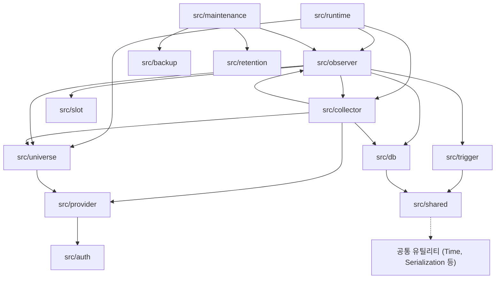

# Source Code (src)

이 디렉토리는 Observer 시스템의 핵심 비즈니스 로직과 엔진을 포함하는 모든 소스 코드를 관리합니다.

## 시스템 구성 및 의존성 (Import Relationships)

시스템은 명확한 레이어 구조를 가지며, 상위 레이어에서 하위 레이어로의 단방향 의존성을 지향합니다.

### 패키지 간 의존성 다이어그램

## 아키텍처 레이어 설명

1.  **실행 레이어 (Runtime/Maintenance)**: 시스템의 생명주기를 관리하고 런너를 실행합니다.
2.  **오케스트레이션 레이어 (Observer)**: 데이터의 흐름(Validation -> Guard -> Enrichment -> Dispatch)을 제어하는 핵심 컨트롤러입니다.
3.  **데이터 소스 레이어 (Collector/Universe)**: KIS API로부터 데이터를 수집하거나 관찰 대상(Universe)을 관리합니다.
4.  **물리/인증 레이어 (Provider/Auth/DB)**: 외부 API 연동 및 데이터베이스 저장 등 물리적 입출력을 담당합니다.
5.  **공통 레이어 (Shared)**: 전 패키지에서 공용으로 사용하는 시간 처리, 시리얼라이제이션 등 유틸리티를 제공합니다.

## 주요 패키지 상세

### 1. 핵심 엔진 및 실행 (Core & Execution)
- **[observer/](observer/)**: 시스템의 중추. 이벤트 버스, 데이터 검증(Validation), 필터(Guard), 데이터 보강(Enrichment) 및 API 서버를 포함합니다.
- **[runtime/](runtime/)**: 시스템 실행 엔트리포인트 및 런너. 수집 프로세스와 유지보수 태스크의 생명주기를 관리합니다.

### 2. 데이터 수집 및 연동 (Data Ingestion)
- **[collector/](collector/)**: KIS API 데이터 수집기 (Track A, Track B).
- **[provider/](provider/)**: 외부 데이터 소스(KIS REST/WebSocket) 연동 물리 계층.
- **[auth/](auth/)**: KIS API 인증 및 토큰 생명주기 관리.
- **[universe/](universe/)**: 관찰 대상 종목(Universe) 관리 및 스케줄러.

### 3. 데이터 저장 및 공유 (Data & Storage)
- **[db/](db/)**: PostgreSQL 연동, 테이블 스키마 및 마이그레이션 로직.
- **[shared/](shared/)**: 공통 유틸리티, 시리얼라이제이션, 시간 및 타임존 처리 상수.

### 4. 부가 시스템 (Sub-systems)
- **[maintenance/](maintenance/)**: 로그 로테이션, 데이터 정리 등 시스템 유지보수 기능.
- **[monitoring/](monitoring/)**: 시스템 헬스 체크 및 Prometheus 메트릭 노출.
- **[automation/](automation/)**: 자동화 워크플로우 관련 로직.
- **[backup/](backup/) / [retention/](retention/)**: 데이터 백업 및 보관 정책 관리.

## 개발 가이드
- 새로운 기능을 추가할 때는 `observer/` 내의 인터페이스를 준수하고 `shared/` 유틸리티를 최대한 활용하십시오.
- 모든 비즈니스 로직은 `tests/` 폴더 내의 테스트 코드로 검증되어야 합니다.
- 시스템의 단일 진실 소스(SSoT)는 `docs/dev/archi/`의 아키텍처 문서를 참고하십시오.
