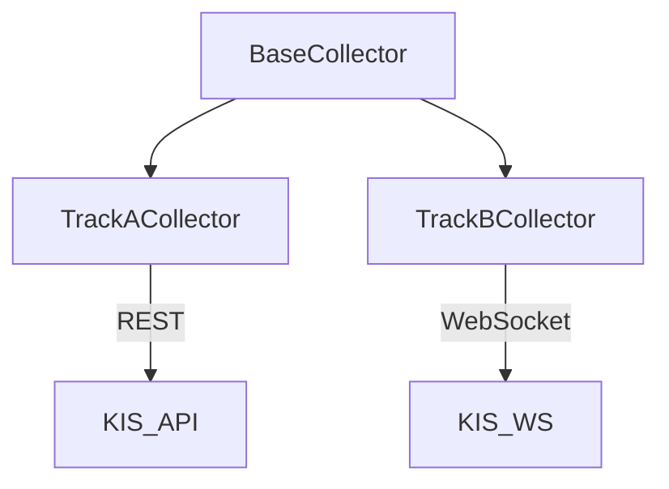

# Collector Module

시장 데이터 수집 및 초기 필터링을 담당하는 핵심 모듈입니다.

## 핵심 목표
- **가격 필터링**: KIS API 수집 시점 또는 수집 직후 **4000 KRW 이상** 종목만 선별.
- **아카이빙**: 수집된 스냅샷 데이터를 `config/observer/*.jsonl` 및 `data/` 경로에 JSONL 형식으로 저장.

## 클래스 구조

### 1. BaseCollector
모든 수집기의 공통 인터페이스 및 유틸리티 제공.
- 타임존 관리 (`TimeAwareMixin`)
- 장중 시간 판별 (`is_in_trading_hours`)
- 추상 메서드: `collect_once()`, `on_snapshot()`

### 2. TrackACollector (Snapshot)
주로 REST API를 통해 전체 시장의 스냅샷 또는 분봉 데이터를 수집합니다.
- **특징**: 전체 종목 스캔, 가격 필터(4000원↑) 적용.
- **저장**: 관찰된 데이터를 `ObservationSnapshot` 형태로 변환 후 JSONL 아카이브 저장.

### 3. TrackBCollector (Real-time)
WebSocket을 통해 실시간 체결 및 호가 데이터를 수집합니다.
- **특징**: 독립적인 심볼 리스트 관리, SlotManager를 통한 동적 구독 관리.
- **데이터**: 2Hz 주기의 실시간 체결 정보를 `scalp` 경로에 JSONL로 기록.

## 데이터 흐름
1. KIS API 수집 (REST/WS)
2. **4000원 미만 종목 필터링**
3. `ObservationSnapshot` 객체 보강 (Enrichment)
4. JSONL 파일 아카이빙 (`JsonlFileSink`)

## 중복 파일 정리
Track B는 `track_b_collector.py` 하나로 통합 운영되며, 이전의 프로토타입 파일(`independent_track_...`)은 모두 제거되었습니다.
